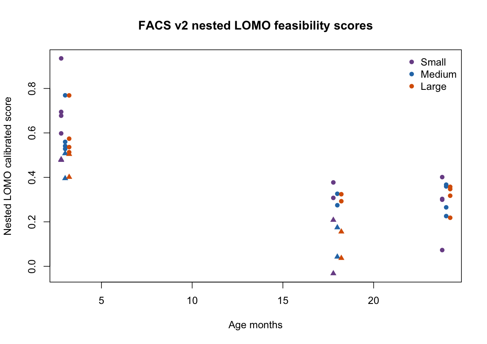
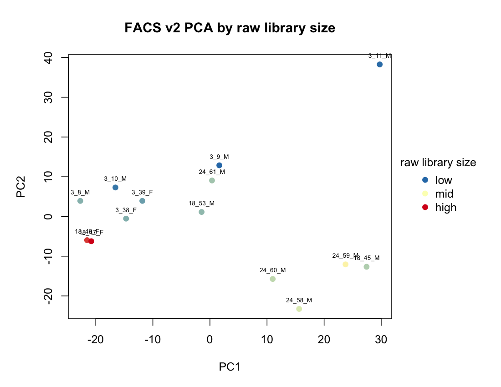
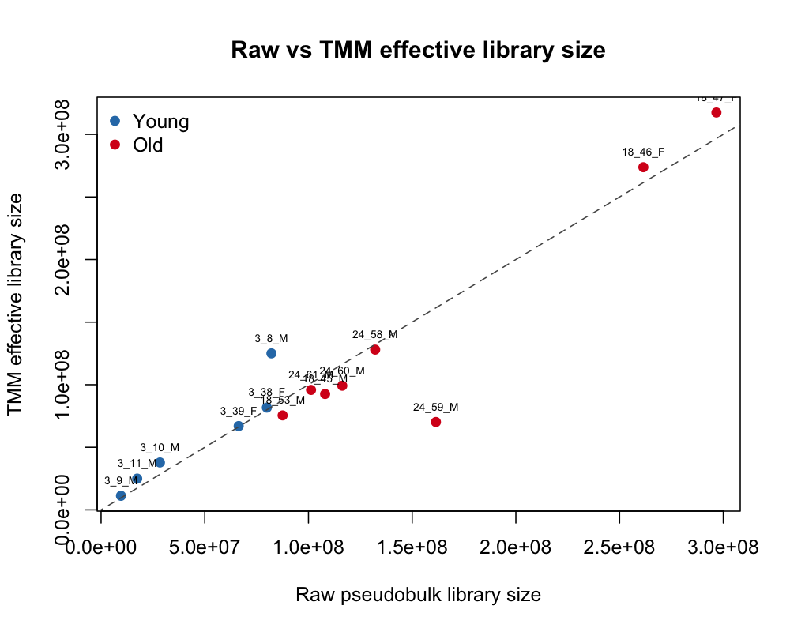
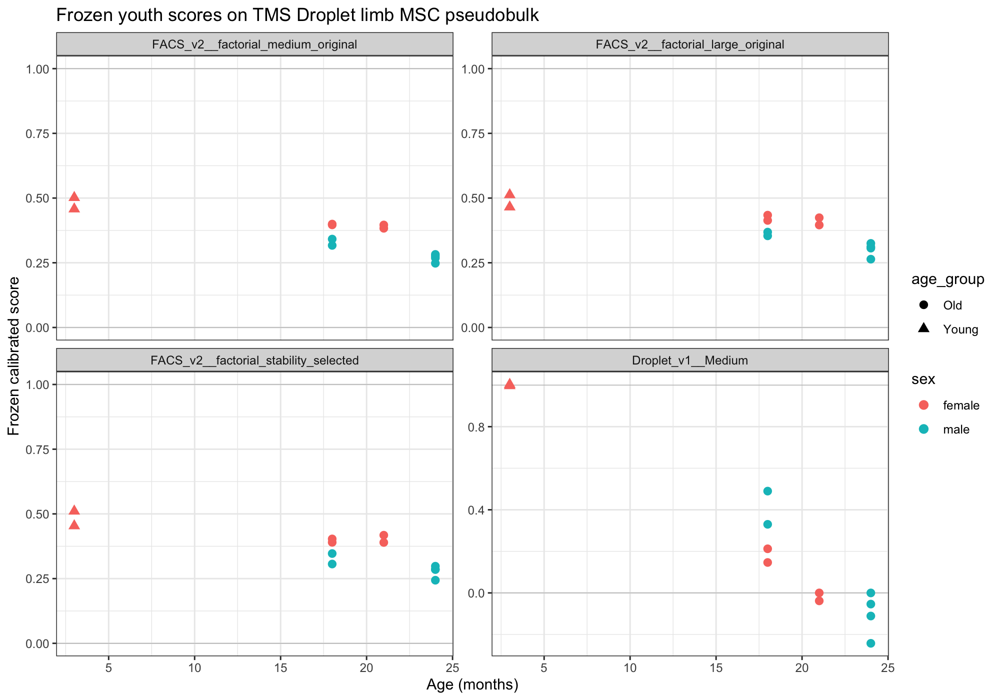
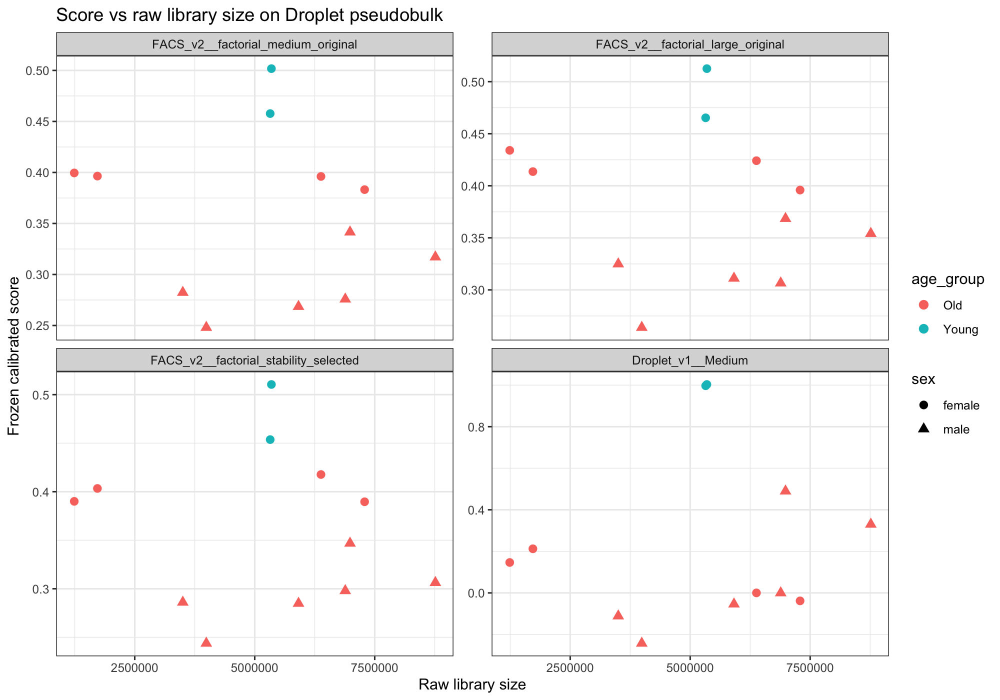
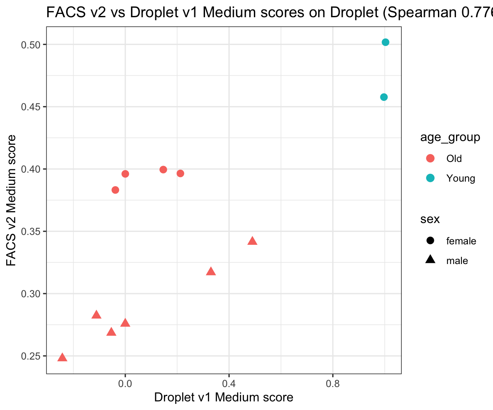
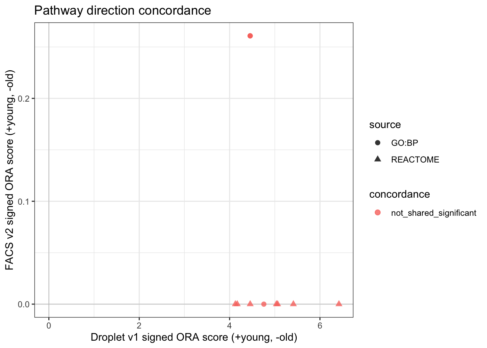

# TMS FACS Limb Muscle MSC Youth Score v2: Final Experiment Report

## Executive Summary

This deliverable freezes the **FACS-derived Youth Score v2** for TMS Limb_Muscle mesenchymal stem cells. The model was developed on mouse-level pseudobulk, not single cells treated as independent donors. The primary model is `factorial_medium_original`, with Large, Stability-Selected, Equal-Weight, and Age-Only comparators exported for audit.

The work followed the mentor-review priorities: donor-level validation, sex-aware factorial modeling, explicit technical-axis audits, no post-hoc technical hard filtering, nested feature selection, baseline comparison including elastic net, structural 3m-vs-18m sensitivity, 24m extension, formal permutation, frozen export, parser equivalence, and within-TMS cross-assay sensitivity on Droplet.

Final position: the model is internally finalized and frozen. It shows cross-assay directional transportability to TMS Droplet Limb Muscle MSC, but remains not externally validated and should not be described as a universal continuous aging clock.

## Data

Training data are the filtered TMS FACS Limb_Muscle MSC subset.

- Raw single-cell subset: `22966` genes x `935` cells.
- Mice: `14`.
- Young cells: `264` from 3m mice.
- Old cells: `671` from 18m/24m mice.
- Mouse-level pseudobulk was used for all donor-level modeling.

Geneformer-compatible raw-data files are intentionally not included in this GitHub package. They are stored in a separate Google Drive bundle: `../geneformer_input_facs_limb_msc_youth_score_v2/` (URL placeholder in `README.md`). The H5AD file is cells x genes; the Matrix Market file is genes x cells.

## Mentor Requirements Trace

| Requirement | Implementation |
|---|---|
| Do not treat cells as independent donors | All model training/evaluation used mouse-level pseudobulk. |
| Consider sex adjustment | Full factorial age-by-sex group contrasts were used where estimable. |
| Avoid post-hoc technical overfitting | Technical penalty was evaluated as sensitivity and not used to retune the primary model. |
| Fully nested validation | LOMO folds rebuilt gene filter, normalization, DE, ranking, signature, weights, calibration, and held-out score. |
| Mark weak support | Weak-support folds were tracked in diagnostics. |
| Compare baselines | Age-only, PC1, elastic net, equal-weight, large, and stability-selected comparators were run. |
| Test structural design issues | 3m-vs-18m sensitivity and frozen 24m extension were performed. |
| Formal null | 999 sex-stratified complete-age-label nested permutations were run for frozen primary. |
| Freeze deployable model | Full-data frozen artifacts and parser were exported. |
| Cross-assay sensitivity | Frozen FACS v2 model was applied to TMS Droplet Limb MSC without retuning. |

## Core Scoring Formula

For a target pseudobulk sample `x`, the parser computes log2 CPM:

```text
E_g(x) = log2(1 + 1e6 * count_g(x) / sum_h count_h(x))
```

Using frozen FACS training parameters:

```text
z_g(x) = (E_g(x) - mu_g) / s_g
```

Module scores:

```text
S_Y(x) = weighted_mean(z_g(x), g in young_high)
S_O(x) = weighted_mean(z_g(x), g in old_high)
S_raw(x) = S_Y(x) - S_O(x)
```

Calibration:

```text
YouthScore(x) = (S_raw(x) - M_old) / (M_young - M_old)
```

Because `M_young` and `M_old` are full-training medians, full-data apparent Young/Old separation is fixed by construction and is not validation evidence.

## Primary Model

- Primary: `factorial_medium_original`.
- Size: 100 genes, 50 young-high + 50 old-high.
- Comparators: `factorial_large_original`, `factorial_stability_selected`, `factorial_medium_equal_weight`, `age_only_de`.

See `models/` for signatures and calibration.

## Internal Nested LOMO Model Comparison

Primary nested LOMO result:

- AUC: 1.000
- all-age rho: -0.713
- old-only rho: 0.436
- library rho: -0.846
- median Jaccard: 0.449



## Donor Bootstrap

Bootstrap quantified uncertainty, not winner selection. For the primary model:

| metric                      |   observed |    ci_low |   ci_high |   valid_bootstrap_n |   total_bootstrap_n |
|:----------------------------|-----------:|----------:|----------:|--------------------:|--------------------:|
| auc                         |   1        |  1        |  1        |                9999 |               10000 |
| all_age_rho                 |  -0.712587 | -0.870208 | -0.238378 |               10000 |               10000 |
| old_only_rho                |   0.436436 | -0.427793 |  0.906597 |                9815 |               10000 |
| library_rho                 |  -0.846154 | -0.986425 | -0.559078 |               10000 |               10000 |
| young_old_median_difference |   0.264829 |  0.149961 |  0.438579 |                9999 |               10000 |

## Formal 999-Permutation Null

Permutation definition was locked before running: complete 3m/18m/24m labels were reassigned within sex strata; every permutation reran the full nested primary pipeline.

- Primary statistic: `abs_all_age_rho` observed 0.713, empirical p=0.103.
- Supporting statistic: `abs(AUC - 0.5)` observed 0.500, empirical p=0.036.
- Valid permutations: 999.

Interpretation: the primary Spearman statistic was not significant at the 0.05 level, while AUC-style young/old separation was stronger. This supports a cohort-state separator more than a universal continuous aging clock.

## Technical Burden and Equal-Cell Sensitivity

Technical penalty reduced selected-gene technical burden but did not eliminate donor-level score-library association, so it was not adopted as the primary model. Equal-cell sensitivity reduced depth dependence but weakened age signal and did not resolve trajectory concerns.




## 3m-vs-18m and 24m Extension

The 3m-vs-18m structural sensitivity reduced technical association but weakened signal. Frozen 3m/18m scoring applied to 24m did not support a monotonic 3m > 18m > 24m trajectory, especially in male-only 24m extension. This limits interpretation as a continuous aging trajectory.

## Full-Data Frozen Export and Parser Equivalence

Parser numerical equivalence passed at machine precision for the primary model:

- min gene coverage: 1.000
- min weighted coverage: 1.000
- max calibrated score difference: 1.776e-15

## Cross-Assay Sensitivity: FACS v2 to Droplet

The frozen FACS v2 model was applied unchanged to TMS Droplet Limb Muscle MSC pseudobulk.

FACS v2 Medium on Droplet:

- coverage: 1.000
- AUC: 1.000
- all-age rho: -0.873
- old-only rho: -0.778
- young-minus-old median: 0.150
- raw library rho: -0.238

Droplet v1 Medium on Droplet:

- AUC: 1.000
- all-age rho: -0.939
- old-only rho: -0.895
- raw library rho: 0.133





Cross-assay donor bootstrap confirmed directionality for FACS v2 on Droplet: all-age rho and old-only rho intervals remained negative, and young-minus-old median interval remained positive.

## Pathway-Level Concordance

Gene-level overlap between FACS v2 Medium and Droplet v1 Medium was low, but score correlation on Droplet was high. GO:BP/Reactome ORA used a unified FACS/Droplet filtered-gene universe. No shared FDR<0.1 directional pathways were detected under this ORA setup.

Pathway concordance summary:

| category               |   n_terms |
|:-----------------------|----------:|
| not_shared_significant |      2433 |

Interpretation: score-level transportability is supported, but shared pathway-level mechanism is not strongly supported by local GO:BP/Reactome ORA. Hallmark/SASP curated GMT analysis remains a future addition if a stable local gene-set file is provided.



## Limitations

- FACS training cohort has 14 mice and 24m is male-only.
- Sex and age are partially confounded in young/old composition.
- FACS internal primary score had strong library-size association; Droplet cross-assay association was weaker but technical independence is not proven.
- 24m extension did not support a monotonic continuous aging-clock interpretation.
- Formal permutation tested label association under the predefined pipeline, not biological specificity.
- No independent external dataset validation has been completed.
- Hallmark/SASP pathway concordance was not completed because remote gene-set sources failed; only local GO:BP/Reactome ORA is included.

## File Map

- `models/`: frozen signatures and calibration.
- `parser/score_facs_v2_youth_model.R`: deployable scoring function.
- Geneformer-ready raw-count FACS Limb MSC subset: stored outside this GitHub package in `../geneformer_input_facs_limb_msc_youth_score_v2/` for Google Drive upload.
- `data/`: compact metadata and frozen full-data training scores; large count matrices omitted from GitHub and regenerated from the external raw-data bundle.
- `tables/`: compact validation outputs.
- `figures/`: report figures.
- `reports/`: step-level reports and model card.
- `scripts/`: archival reproduction scripts; full reruns require the original project layout and external data inputs, while routine scoring only needs `parser/`, `models/`, and a genes x samples count matrix.
