# TMS Droplet Limb Muscle MSC Youth Score v1: Final Experiment Report

## Executive Summary

This folder contains the final deliverable for the Droplet-based Tabula Muris Senis `Limb_Muscle` mesenchymal stem cell Youth Score v1.

This version was developed using the TMS Droplet cohort and should be treated as a completed methodological and modeling baseline. A donor-richer TMS FACS cohort may be evaluated separately in a future version.

Final decision:

- `primary_model = Medium`
- `comparator_model = Large`
- `bootstrap_stability = not_assessed`
- `permutation_scope = practical_training_pipeline_null`
- Medium v1 uses 100 genes: 50 young-high and 50 old-high.
- Large is retained as a high-stability comparator, not as the default model.
- Equal-weight Medium is exported as a sensitivity version because Step 16 showed that performance depends primarily on gene identity and young-high/old-high module assignment; the precise relative weights within each module contribute little additional discrimination in this dataset.

Main model files:

- `models/limb_msc_general_youth_score_v1_signature.csv`
- `models/limb_msc_general_youth_score_v1_calibration.json`
- `R/score_limb_msc_youth.R`

## Folder Contents

```text
deliverables/limb_msc_youth_score_v1/
  R/
    score_limb_msc_youth.R
  models/
    limb_msc_general_youth_score_v1_signature.csv
    limb_msc_general_youth_score_v1_signature_equal_weight_medium.csv
    limb_msc_general_youth_score_v1_large_comparator_signature.csv
    limb_msc_general_youth_score_v1_calibration.json
  data/
    pseudobulk_logcpm.csv
    pseudobulk_filtered_counts.csv
    tms_limb_msc_pseudobulk_metadata_labeled.csv
  tables/
    key score, validation, robustness, and single-cell result tables
  figures/
    QC, EDA, DE, validation, robustness, and single-cell figures
  scripts/
    reproducible scripts for Steps 1-17
```

The original BPCells single-cell matrix is not duplicated here because it is a large source data object. The deliverable contains the final model, parser, required pseudobulk score inputs, and all summary tables/figures needed to audit the final result.

## How To Score Pseudobulk Samples

Input must be a gene-by-sample logCPM matrix with gene names as row names.

```r
source("R/score_limb_msc_youth.R")

logcpm <- read.csv("data/pseudobulk_logcpm.csv", row.names = 1, check.names = FALSE)
scores <- score_limb_msc_youth(as.matrix(logcpm))
```

For equal-weight Medium sensitivity:

```r
scores_equal_weight <- score_limb_msc_youth(as.matrix(logcpm), equal_weight = TRUE)
```

The score function returns raw module score, calibrated youth score, clipped score, gene coverage, and weighted coverage.

## Core Score Formula

For each signature gene:

```text
z_g(x) = (x_g - mu_g) / s_g
```

For a sample `x`:

```text
S_young(x) = sum(w_g * z_g(x), g in G_young) / sum(|w_g|, g in G_young)
S_old(x)   = sum(w_g * z_g(x), g in G_old)   / sum(|w_g|, g in G_old)
S(x)       = S_young(x) - S_old(x)
```

Training calibration:

```text
Y_raw(x) = (S(x) - M_old) / (M_young - M_old)
Y_clipped(x) = clip(Y_raw(x), 0, 1)
```

Because this calibration uses the training medians, the training-set median scores are fixed at 0 for Old and 1 for Young by construction; this separation is not itself validation evidence.

Medium v1 calibration:

```text
M_young = 2.50533558598289
M_old = -0.738884595086052
M_young - M_old = 3.24422018106894
```

Candidate ranking used:

```text
r_g = pi_LOMO * pi_depth * pi_sex
q_g = |adjusted_logFC_g| * |age_rho_g| * r_g
```

Final score weights used:

```text
w_g = min(|adjusted_logFC_g|, 3) * r_g
```

`|age_rho|` was not multiplied into the final score weight because it had already been used for candidate ranking.

## Step-By-Step Workflow

### Step 1: TMS Candidate Selection Reproduction

The original tissue/cell-type selection work was reproduced to identify a feasible tissue-cell-type target. The useful source inputs were the TMS droplet metadata CSV and BPCells directory.

Output:

- `outputs/tms_candidate_selection/droplet_candidate_selection_reproduction.md`

Conclusion:

- `Limb_Muscle` mesenchymal stem cell was retained as the working candidate.

### Step 2: Limb Muscle MSC Sample Audit

The extracted Limb Muscle MSC data were audited by mouse, age, sex, batch/library, and cell count.

Key counts:

- Young cells, 3m: 1,468
- Old cells, 18/21/24m: 8,181
- Young mice: 2
- Old mice: 10

Important design issue:

- Both young mice are female.
- Old mice include both female and male.
- Therefore all downstream modeling must be sex-adjusted but cannot claim sex independence.

Figure:

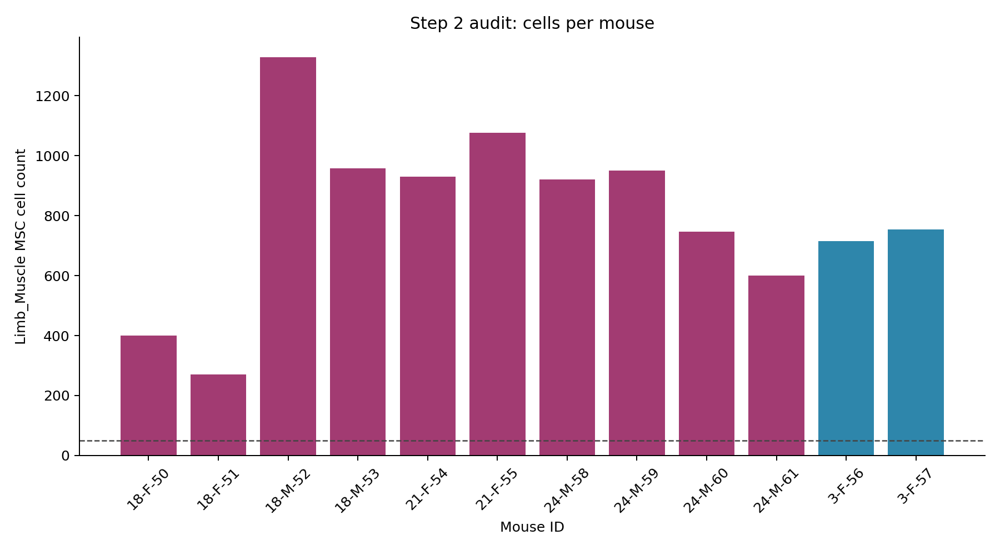

### Step 3: Pseudobulk Construction

Single cells were aggregated to mouse-level pseudobulk counts.

Result:

- Matrix: 20,138 genes x 12 mice before filtering
- Total counts conserved: 63,380,682
- Metadata retains age, sex, cell count, raw library size, and effective library size fields.

### Step 4: Gene Filtering

Genes were retained if:

```text
CPM > 1 in at least 2 mice
```

Result:

- 20,138 genes before filtering
- 12,735 genes retained

### Step 5: TMM Normalization

edgeR TMM normalization was applied to filtered pseudobulk counts.

Figures:

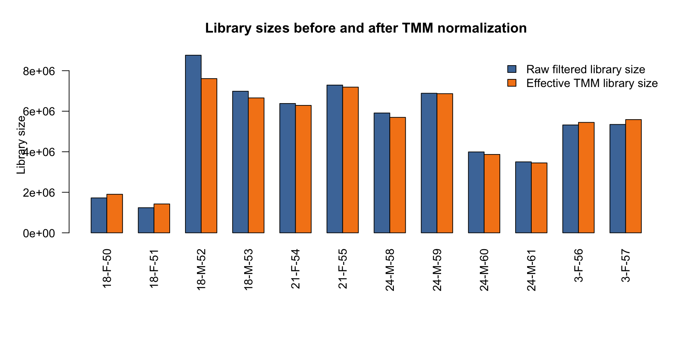

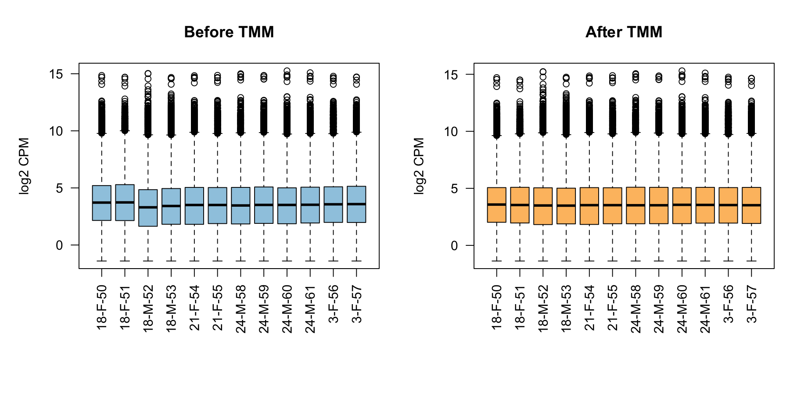

### Step 6: EDA And Technical Axis Check

PCA used top 2,000 highly variable genes, not all 12,735 filtered genes.

Dedicated checks included:

- PCA colored by age
- PCA colored by sex
- PCA colored by raw/effective library size
- PCA colored by cell count
- PC1 associations with age, sex, cell count, raw library size, and effective library size
- Audit of low-depth old female mice

Findings:

- PC1 variance: 29.88%
- PC2 variance: 14.46%
- PC1 was associated with sex and technical depth.
- `18-F-50` and `18-F-51` were low-depth old female samples and were retained in the primary model, then handled through sensitivity analysis.

Figures:

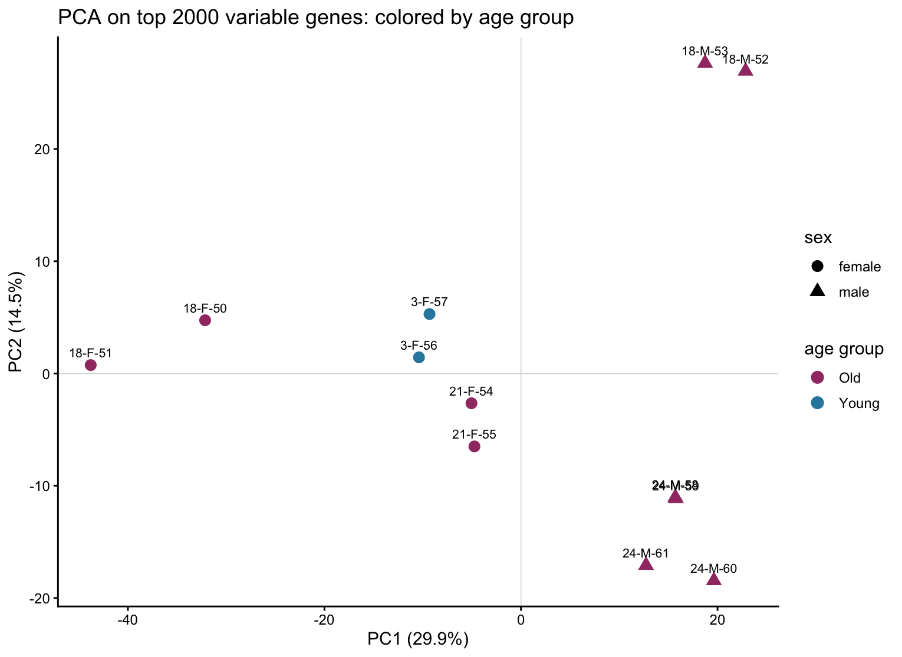

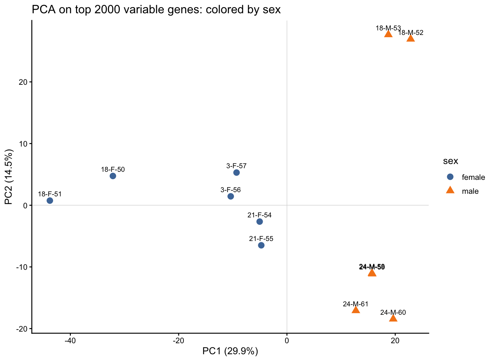

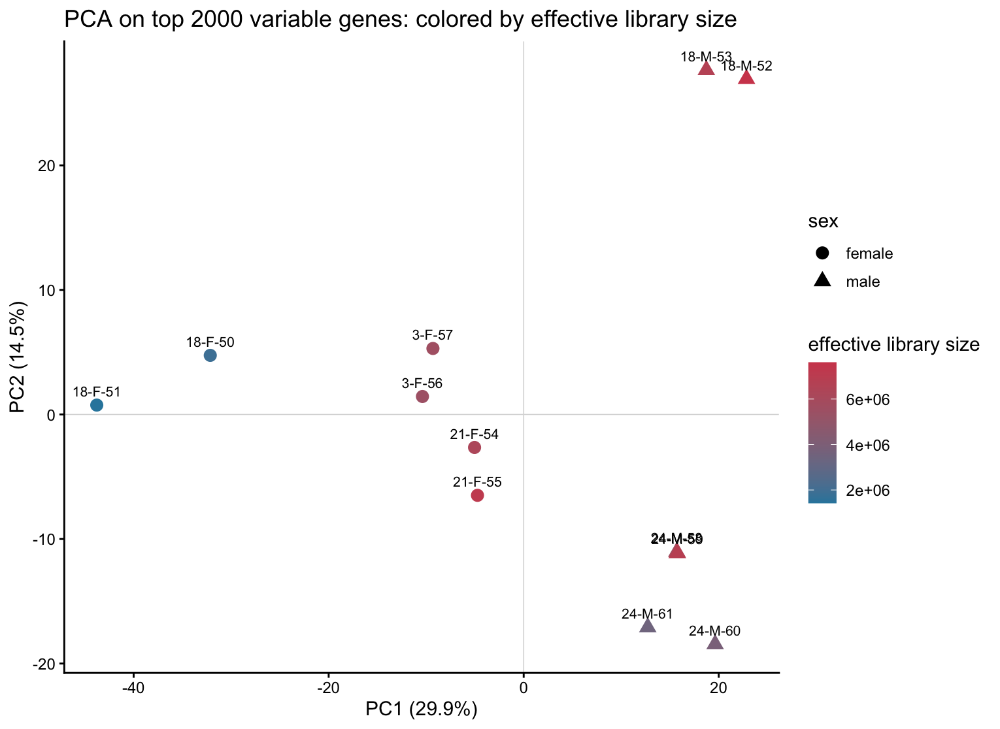

### Step 7: Label Definition

Training labels:

- Young: 3m
- Old: 18m, 21m, 24m

The design `~ sex + age_group` was checked and found full rank for the full dataset.

### Step 8: Sex-Adjusted Differential Expression

Primary DE model:

```text
~ sex + age_group
```

Constraints:

- Old is the reference age group.
- The age coefficient is `age_groupYoung`.
- No `sex:age_group` interaction was fitted because there are no young male mice.
- Library size was not added as an ordinary covariate; edgeR offsets/TMM handle normalization.
- Low-depth old female samples were retained in the primary model.

Summary:

- Genes tested: 12,735
- `|logFC| > 0.5`: 2,213
- `FDR < 0.1`: 15
- Initial candidates for stability review: 1,652

FDR-significant genes were not used alone to define the final signature. Feature selection relied on effect size, continuous-age consistency, LOMO stability, low-depth robustness, and sex-sensitivity filtering.

Figures:

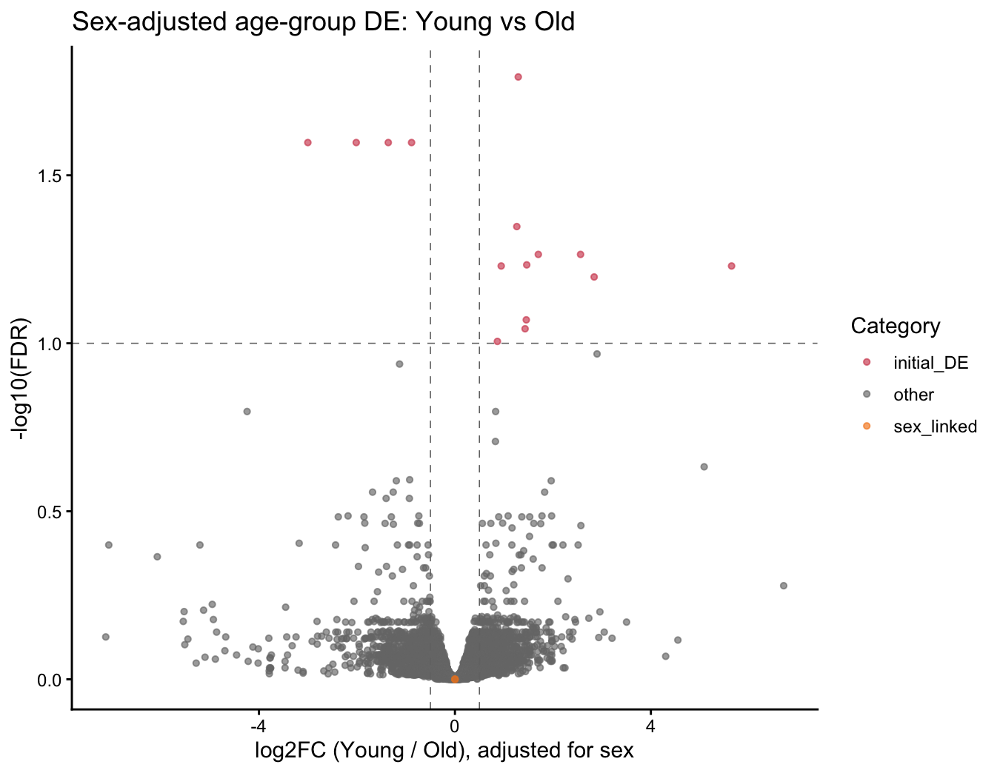

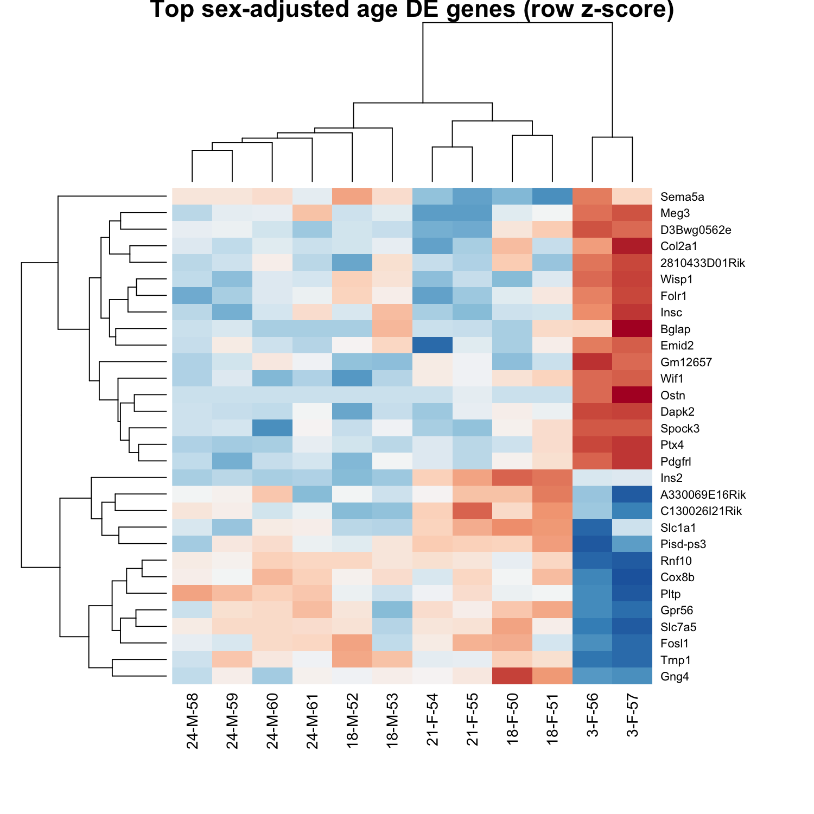

### Step 9: Stability And Robustness Filtering

Stability filtering included:

- Leave-one-mouse-out refits
- Low-depth sensitivity excluding `18-F-50` and `18-F-51`
- Sex-linked gene exclusion
- Strong old male-vs-old female sex-sensitive gene filtering

Reliability:

```text
r_g = pi_LOMO * pi_depth * pi_sex
```

Result:

- Genes evaluated: 12,735
- Genes passing Step 9 initial reliability: 1,522
- Full/reduced logFC Spearman: 0.874

### Steps 10-11: Candidate Compression And Original Workflow Backfill

Step 10 compressed candidates using:

```text
q_g = |adjusted_logFC| * |age_rho| * r_g
```

Result:

- Young-high passing genes: 715
- Old-high passing genes: 807
- Top 100 per direction exported
- Core top 50 per direction exported

Original workflow outputs through Step 11 were also backfilled. Cell bootstrap was not performed and was explicitly marked false/not assessed.

The original Step 11 stable sets and the later compressed reliability pool use related but not identical selection definitions; the final score was constructed from the Step 10 ranked reliability pool.

### Steps 12-13: Candidate Youth Scores And Calibration

Three candidate score sizes were created:

| Version | Young-high | Old-high | Total |
|---|---:|---:|---:|
| Small | 20 | 20 | 40 |
| Medium | 50 | 50 | 100 |
| Large | 100 | 100 | 200 |

Training medians were used for calibration. For Medium:

```text
M_young = 2.50533558598289
M_old = -0.738884595086052
denominator = 3.24422018106894
```

All training samples had total, module, and weighted coverage of 1.

### Step 14: Nested Leave-One-Mouse-Out Validation

This was the main leakage-safe validation step.

For each held-out mouse:

1. Remove one mouse.
2. Recompute training-side gene filtering.
3. Recompute TMM.
4. Refit `~ sex + age_group` DE.
5. Recompute continuous age trend.
6. Recompute inner LOMO stability where estimable.
7. Recompute low-depth sensitivity.
8. Recompute sex-sensitive filtering.
9. Re-rank genes.
10. Re-select Small/Medium/Large signatures.
11. Recompute training `mu_g`, `s_g`, `M_young`, and `M_old`.
12. Score the held-out mouse.

Important limitation:

- When a young mouse is held out, the training set contains only one young mouse.
- These folds are `held_out_young_stress_test`, not ordinary CV folds.

Summary:

| Version | LOMO rho all | LOMO rho old-only | Technical rho, effective library | Technical rho, cell count |
|---|---:|---:|---:|---:|
| Small | -0.699 | -0.467 | -0.035 | -0.077 |
| Medium | -0.939 | -0.934 | -0.021 | -0.035 |
| Large | -0.961 | -0.934 | -0.028 | -0.056 |

### Step 15: Model Comparison

Model comparison used nested LOMO scores.

Figure:

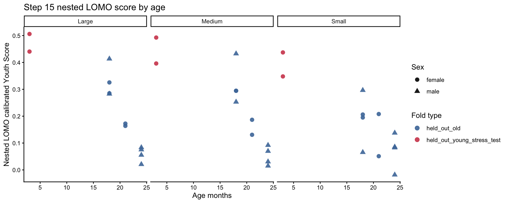

Sex diagnostic:

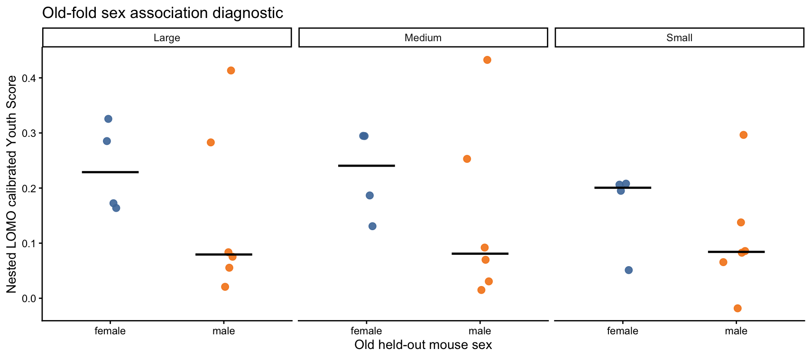

Technical diagnostic:

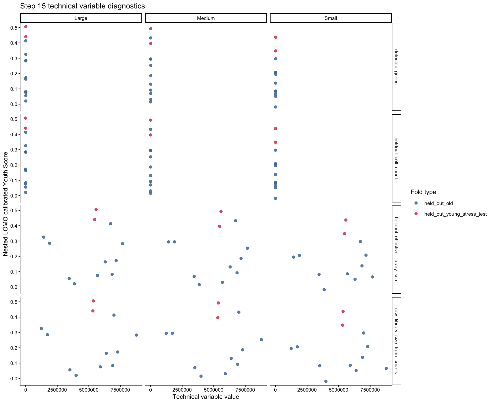

Decision:

| Criterion | Small | Medium | Large |
|---|---|---|---|
| LOMO age correlation | Weakest | Strong | Strong |
| Old-only correlation | Weak | Strong | Strong |
| Sex gap | Smallest | Largest | Intermediate |
| Technical correlation | Review | Low | Review |
| Signature stability | Lowest | Medium | Highest |
| Model size | Best | Balanced | Largest |
| Role | Not recommended | Primary candidate | High-stability comparator |

Medium was selected because it nearly matched Large on age ordering, had better technical-variable behavior, and used half as many genes.

### Step 16: Null And Robustness Controls

Controls focused on Medium, with Large as comparator.

#### Age-label permutation

Mouse-level age labels were permuted and the training-side pipeline was rerun.

Important scope:

```text
permutation_scope = practical_training_pipeline_null
```

This is not a full nested outer-LOMO permutation null.

For Medium and Large, the observed score-age association reached empirical `p = 1/21 ~= 0.048` under this practical training-pipeline permutation control. Because only 20 permutations were run, this is the minimum attainable nonzero empirical p-value and should be interpreted conservatively.

#### Random gene-set control

300 expression-matched random gene sets were tested with Medium size:

- 50 young-module genes
- 50 old-module genes

#### Weight-shuffle control

1,000 Medium weight-shuffle controls were run with fixed Medium genes.

Interpretation:

- Medium beats expression-matched random gene sets.
- Weight shuffling barely changes performance, suggesting that performance depends primarily on gene identity and young-high/old-high module assignment; the precise relative weights within each module contribute little additional discrimination in this dataset.

#### Low-depth score sensitivity

The model was retrained after excluding `18-F-50` and `18-F-51`.

Medium score/rank agreement:

```text
score Spearman all mice = 0.979
rank Spearman all mice = 0.979
```

#### Sex robustness

A no-sex-filter stress test did not worsen Medium; it selected no obvious sex-linked or strong sex-sensitive genes. Large selected one strong sex-sensitive gene in the stress version and remains only a comparator.

Figures:

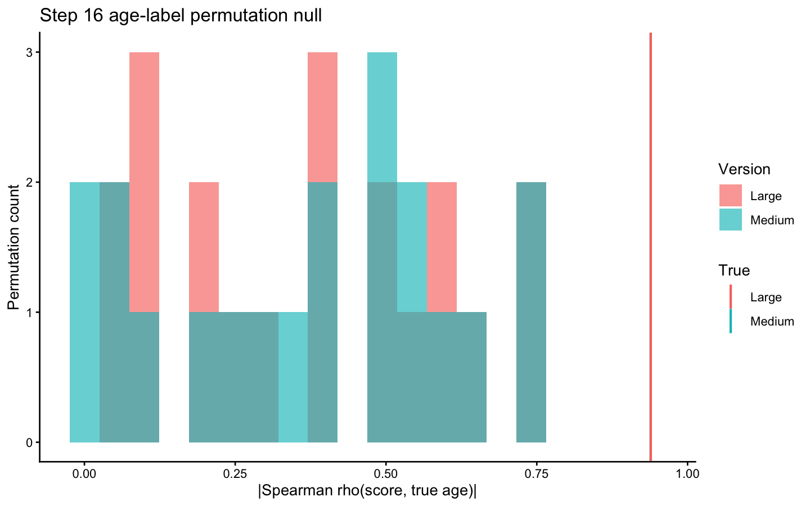

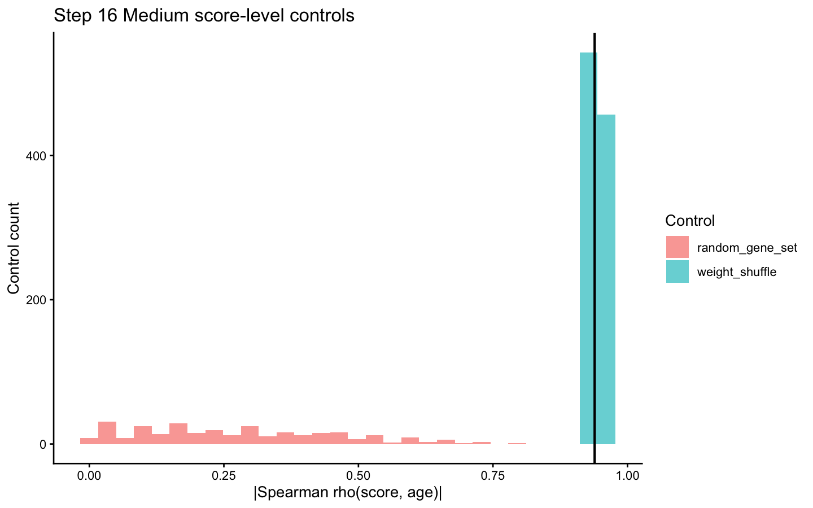

### Step 17: Final Export And Single-Cell Sensitivity

Final exports:

- Medium v1 weighted signature
- Medium equal-weight sensitivity signature
- Large comparator signature
- Calibration JSON
- R scoring function

Parser verification:

```text
max absolute raw-score difference vs Step 12 Medium = 3.9968e-15
max absolute calibrated-score difference vs Step 12 Medium = 2.44249e-15
```

Single-cell scoring:

- Cells scored: 9,649
- Signature genes used: 100/100
- Single-cell score is a module-score sensitivity analysis, not the primary pseudobulk parser.

Cell-level aggregate vs pseudobulk Medium:

```text
Spearman(cell median, pseudobulk raw) = 0.993
Pearson(cell median, pseudobulk raw) = 0.964
Spearman(cell mean, pseudobulk raw) = 0.993
```

Figure:

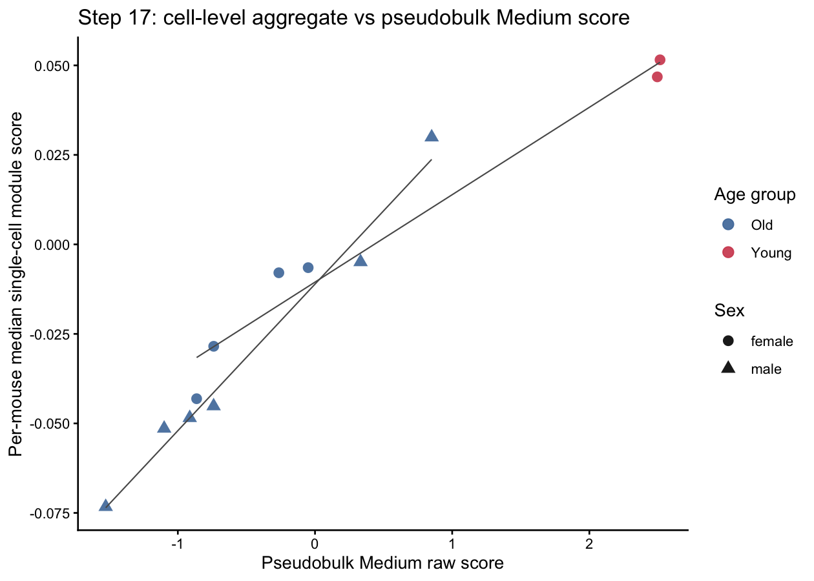

## Final Model Metadata

From `models/limb_msc_general_youth_score_v1_calibration.json`:

```text
model_version = limb_msc_general_youth_score_v1
organism = Mus musculus
tissue = Limb_Muscle
cell_type = mesenchymal stem cell
primary_model = Medium
comparator_model = Large
signature_size = 100
young_high_genes = 50
old_high_genes = 50
minimum_gene_coverage = 0.8
weighted_coverage_threshold = 0.8
bootstrap_stability = not_assessed
permutation_scope = practical_training_pipeline_null
```

Sex composition:

```text
Young: female:2
Old: female:4; male:6
```

The final score is sex-adjusted at the feature-selection/modeling stage, but it is not sex-independent.

## Important Limitations

1. Young samples include only two mice, both female.
2. Young-heldout folds are stress tests because training contains only one young mouse.
3. Cell bootstrap was not performed:

```text
bootstrap_stability = not_assessed
```

4. Age-label permutation was practical training-pipeline null, not exhaustive nested outer-LOMO permutation:

```text
permutation_scope = practical_training_pipeline_null
```

5. The single-cell score is a sensitivity analysis. The primary exported parser is pseudobulk logCPM based.

6. The final parser has not yet been validated on an independent external dataset or a different assay platform.

## Future Work

A TMS FACS Limb Muscle MSC cohort with fewer cells but improved donor replication has been identified. Future work may retrain the Youth Score using the FACS cohort and use the current Droplet model as a cross-assay validation baseline.

## Reproducibility

The scripts in `scripts/` preserve the step order used to generate this deliverable. The core execution path is:

```text
Step 1  reproduce_tms_candidate_selection.py
Step 2  audit_limb_muscle_msc_step2.py
Step 3  construct_limb_muscle_msc_step3_pseudobulk.R
Step 4  filter_limb_muscle_msc_step4_genes.R
Step 5  normalize_limb_muscle_msc_step5_tmm.R
Step 6  eda_limb_muscle_msc_step6.R
Step 7  define_limb_muscle_msc_step7_labels.R
Step 8  de_limb_muscle_msc_step8_sex_adjusted.R
Step 9  stability_limb_muscle_msc_step9.R
Step 10 compress_limb_muscle_msc_step10_signature.py
Step 11 backfill_original_steps9_to_11.R
Step 12 build_limb_muscle_msc_step12_13_scores.R
Step 14 validate_limb_muscle_msc_step14_nested_lomo.R
Step 15 compare_limb_muscle_msc_step15_models.R
Step 16 robustness_limb_muscle_msc_step16_controls.R
Step 17 finalize_limb_muscle_msc_step17_exports_and_single_cell.R
```

Use project-local R libraries when running from the original project:

```text
R_LIBS_USER=.Rlibs Rscript scripts/<script_name>.R
```
