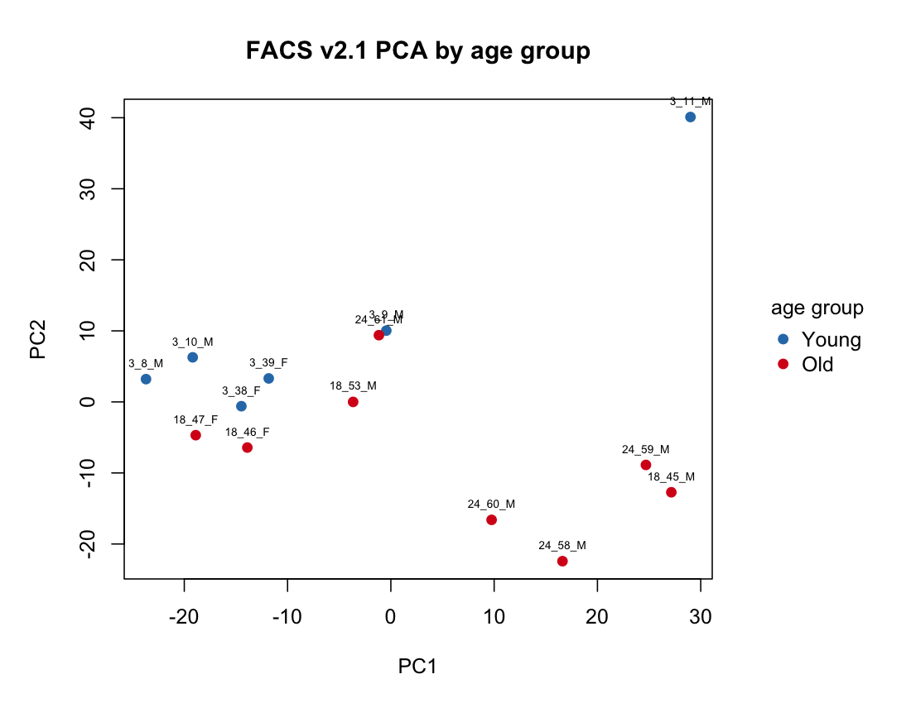
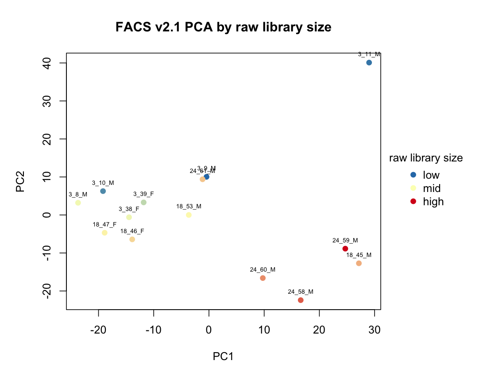
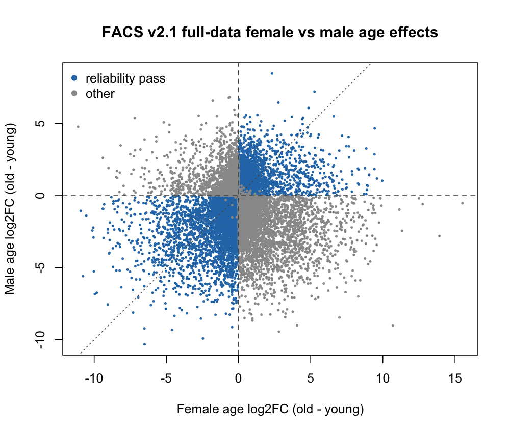
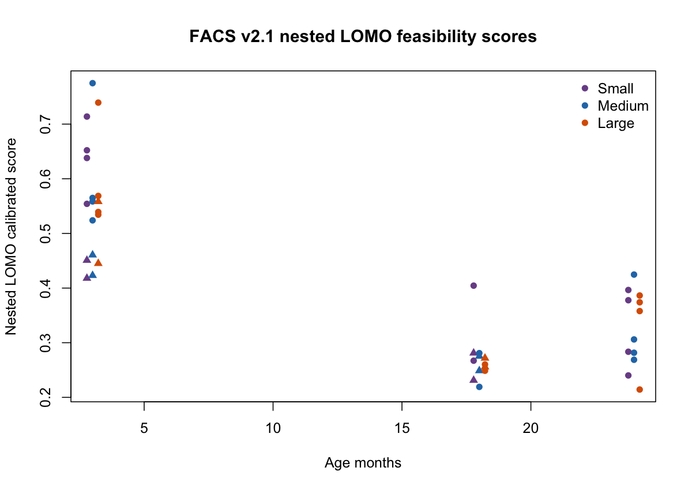
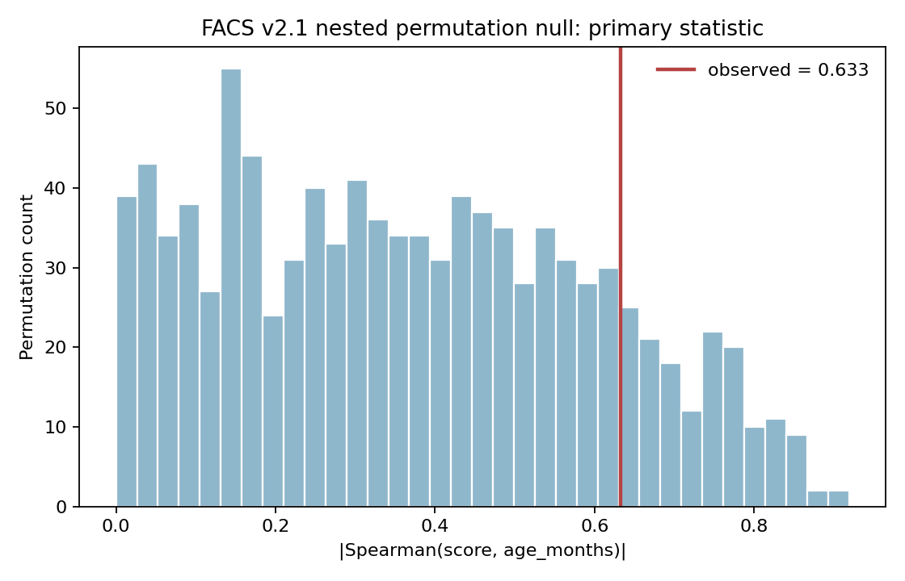

# TMS FACS Limb Muscle MSC Youth Score v2.1: Final Experiment Report

## Executive Summary

FACS Youth Score v2.1 was trained after excluding FACS `Muscle Diaphragm` cells from the TMS FACS Limb Muscle MSC cohort. This correction removed 120 old-only diaphragm cells from mice `18_46_F` and `18_47_F`, leaving 815 forelimb/hindlimb MSC cells across 14 mice.

The final model is a frozen, reproducible FACS Limb Muscle MSC cohort-state score. Its strongest evidence is binary young-old transcriptional state separation. The pre-locked formal nested permutation primary test did not support a robust continuous all-age trajectory beyond the practical randomized-label null. Therefore this model should not be presented as a validated aging clock.

Final interpretation:

- Binary young-old separation: moderate support.
- Continuous aging trajectory: weak support.
- Aging clock claim: not supported.
- Technical independence: not demonstrated.
- External validity: not established.
- Use as current workflow primary frozen FACS model: acceptable.
- Use as strong biological aging conclusion: not acceptable.

## Data Audit

Input data were read from `data_facs/raw_data`, not from the older diaphragm-containing parsed folder. The raw-data bundle was checked before training:

| Check | Result |
|---|---:|
| Cells | 815 |
| Genes | 22,966 |
| Mice | 14 |
| Young 3m cells | 264 |
| Old 18m/24m cells | 551 |
| Diaphragm cells | 0 |
| `tissue == Limb_Muscle` | 815 |
| `cell_ontology_class == mesenchymal stem cell` | 815 |

Remaining `subtissue` values were:

```text
ForelimbandHindlimb             581
Muscle forelimb and hindlimb    203
forelimb and hindlimb            31
```

These are formatting variants of forelimb/hindlimb and were standardized during analysis as `Forelimb_Hindlimb`.

Two cells in `24_59_M` had tiny metadata `n_counts` discrepancies relative to the raw count matrix (`+2` and `-5` UMI), while detected gene counts matched exactly. Training used the raw count matrix itself, not metadata `n_counts`, so this was recorded as a metadata audit note rather than a training blocker.

## Pseudobulk Construction

Single-cell raw counts were aggregated by mouse:

```text
C_{g,m} = sum_{c in mouse m} X_{g,c}
```

Each mouse is one biological sample. Cells were not treated as independent replicates. Mouse-level metadata included age, age group, sex, cell count, pseudobulk library size, and detected genes.

## QC And EDA

Genes were filtered using:

```text
CPM_g > 1 in at least 2 mice
```

This retained 12,824 of 22,966 genes. TMM normalization and voom were used for DE and EDA. PCA was run on the top 2,000 high-variance genes only.

Important technical-axis findings:

| PC | age rho | sex rho | cell-count rho | raw-library rho | TMM-effective-library rho | detected-gene rho |
|---|---:|---:|---:|---:|---:|---:|
| PC1 | 0.417 | 0.471 | -0.194 | 0.341 | -0.226 | -0.952 |
| PC2 | -0.652 | 0.078 | -0.598 | -0.833 | -0.662 | 0.095 |
| PC3 | -0.431 | 0.157 | -0.319 | -0.385 | -0.095 | 0.200 |

These results show substantial technical structure, especially PC1 versus detected genes and PC2 versus library size. Technical independence was therefore not assumed.





## Differential Expression And Candidate Ranking

The main discovery model used sex-aware factorial limma-voom contrasts. Full-data DE was used for candidate discovery only; nested validation recomputed feature selection inside each fold.

Factorial cell-means design:

```text
~ 0 + sex:age_group
```

Contrasts:

```text
female_age = female_old - female_young
male_age   = male_old   - male_young
common_age = (female_age + male_age) / 2
interaction = male_age - female_age
```

Age-only baseline:

```text
~ age_group
```

Candidate genes required direction consistency:

```text
sign(female_age) == sign(male_age)
sign(age_only) == sign(common_age)
not sex-linked
finite common effect and t-statistic
```

Ranking score:

```text
interaction_ratio = |interaction| / (|female_age| + |male_age| + epsilon)
interaction_penalty = 1 / (1 + interaction_ratio)
rank_score = |common_logFC| * |common_t| * interaction_penalty
```

Module assignment:

```text
common_logFC < 0 => young_high
common_logFC > 0 => old_high
```

Full-data DE summary:

- filtered genes tested: 12,824
- age-only FDR < 0.1: 157
- common FDR < 0.1: 25
- primary reliability-pass genes: 6,760
- young-high ranked candidates: 4,017
- old-high ranked candidates: 2,743

FDR-significant genes alone were not used to define the final signature; feature selection relied on effect size, sex-aware consistency, interaction penalty, nested stability, and sensitivity checks.



## Scoring Formula

The frozen parser uses deployable logCPM, not TMM, for external scoring:

```text
E_g(x) = log2(CPM_g(x) + 1)
Z_g(x) = (E_g(x) - mu_g) / s_g
```

where `mu_g` and `s_g` are frozen training-set mean and standard deviation for each signature gene.

Weighted module scores:

```text
M_Y(x) = sum_{g in G_Y} w_g Z_g(x) / sum_{g in G_Y} w_g
M_O(x) = sum_{g in G_O} w_g Z_g(x) / sum_{g in G_O} w_g
S_raw(x) = M_Y(x) - M_O(x)
```

Calibration:

```text
S_cal(x) = (S_raw(x) - C_old) / (C_young - C_old)
```

Higher scores indicate a more young-like FACS training-cohort state. Since calibration uses training medians, apparent full-data young-old separation is not validation evidence.

## Nested LOMO Validation

Each leave-one-mouse-out fold repeated the full training-side workflow from scratch:

1. remove held-out mouse;
2. gene filter;
3. TMM;
4. voom;
5. age-only DE;
6. factorial DE;
7. female, male, common, interaction contrasts;
8. sex-linked filtering;
9. reliability audit;
10. candidate ranking;
11. signature selection;
12. weights;
13. frozen training normalization;
14. held-out scoring.

This avoids feature-selection leakage.

Primary nested LOMO model, `factorial_medium_original`:

| Metric | Value |
|---|---:|
| AUC young vs old | 0.979 |
| all-age Spearman | -0.633 |
| old-only Spearman | 0.655 |
| young-minus-old median | 0.263 |
| library-size Spearman | -0.521 |
| detected-gene Spearman | -0.116 |
| cell-count Spearman | -0.462 |
| median signature size | 100 |
| median Jaccard | 0.429 |
| genes selected in >=75% folds | 58 |
| zero-signature folds | 0 |

Weak-support folds were flagged rather than hidden. Four folds had weak factorial-cell support. All folds remained full rank.



## Model Comparison

The predefined primary remained `factorial_medium_original`. Comparators included Large, equal-weight Medium, stability-selected, age-only DE, PC1 baseline, and elastic net.

| Model | AUC | all-age rho | old-only rho | library rho | Role |
|---|---:|---:|---:|---:|---|
| factorial_medium_original | 0.979 | -0.633 | 0.655 | -0.521 | Primary predefined |
| factorial_large_original | 1.000 | -0.713 | 0.436 | -0.644 | Large comparator |
| factorial_medium_equal_weight | 0.979 | -0.614 | 0.764 | -0.543 | Weight sensitivity |
| factorial_stability_selected | 1.000 | -0.806 | -0.109 | -0.692 | Stability comparator |
| age_only_de | 1.000 | -0.769 | 0.109 | -0.727 | Biological baseline |
| pc1_baseline | 0.854 | -0.511 | 0.218 | -0.424 | Technical-axis baseline |
| elastic_net | 0.646 | -0.206 | -0.109 | -0.366 | ML baseline |

The primary model separates young and old well, but technical correlations remain non-negligible. Stability-selected and age-only comparators also show strong library-size association, reinforcing that technical independence is not demonstrated.

## Structural Sensitivity

### 3m vs 18m Factorial Sensitivity

This sensitivity removes the male-only 24m group and compares 3m vs 18m.

| Metric | Value |
|---|---:|
| mice | 10 |
| AUC | 0.833 |
| all-age rho | -0.569 |
| library rho | -0.333 |
| detected-gene rho | 0.382 |
| cell-count rho | 0.103 |
| young-minus-old median | 0.119 |
| zero-signature folds | 0 |

### Frozen 3m/18m Model Applied To 24m

Male medians:

| Group | Median score |
|---|---:|
| 3m male | 0.966 |
| 18m male | -0.099 |
| 24m male | 0.427 |

The expected monotonic `3m > 18m > 24m` ordering was false. This argues against interpreting the score as a continuous aging trajectory.

## Equal-cell Sensitivity

Equal-cell sensitivity was rerun from the cleaned `data_facs/raw_data` bundle. Two scenarios were used:

1. all 14 mice downsampled to 14 cells per mouse;
2. mice with at least 28 cells downsampled to 28 cells per mouse.

The second scenario is labeled `min25_mice_28_cells` in the output tables for historical continuity with the script configuration, but the v2.1 cleaned cohort contains no mice with 25-27 cells. The `>=25` script filter therefore selected the same 12 mice as a `>=28` filter, and sampling was performed without replacement.

Nested retraining results:

| Scenario | AUC median | all-age rho median | library rho median | young-old median difference |
|---|---:|---:|---:|---:|
| all_mice_14_cells | 0.948 | -0.743 | -0.437 | 0.155 |
| min25_mice_28_cells | 0.750 | -0.340 | -0.350 | 0.114 |

The signal is sensitive to the donor/cell-count structure, especially after excluding the very low-cell donors. This supports a cautious cohort-state interpretation.

## Donor Bootstrap

Bootstrap was used to quantify donor-level uncertainty, not to choose a winner.

For the primary `factorial_medium_original`:

| Metric | Observed | 95% CI |
|---|---:|---:|
| AUC | 0.979 | [0.878, 1.000] |
| all-age rho | -0.633 | [-0.838, -0.120] |
| old-only rho | 0.655 | [0.000, 0.910] |
| library rho | -0.521 | [-0.794, 0.100] |
| young-old median difference | 0.263 | [0.155, 0.395] |

The young-old separation is more stable than the continuous trajectory interpretation. The library-size CI includes substantial negative association, so technical independence is not established.

## Formal 999 Nested Permutation

The formal permutation test was pre-locked before running the full 999 permutations:

- Model: `factorial_medium_original` only.
- Permutation: complete 3m/18m/24m age labels reassigned within sex strata.
- Female composition preserved: 2 x 3m, 2 x 18m.
- Male composition preserved: 4 x 3m, 2 x 18m, 4 x 24m.
- Each permutation reran full nested LOMO feature selection and scoring.
- Primary statistic: `abs_all_age_rho = |Spearman(score, age_months)|`.
- Supporting statistic: `abs(AUC - 0.5)`.

Final QC:

- attempted permutations: 999
- valid null permutations: 999
- failed permutations: 0
- duplicate assignment hashes: 0
- NA scores: 0
- rank-deficient folds: 0
- zero-signature folds: 0

Results:

| Metric | Role | Observed | Null median | Null 95% interval | Empirical p |
|---|---|---:|---:|---:|---:|
| abs_all_age_rho | primary | 0.633 | 0.352 | [0.019, 0.811] | 0.153 |
| abs(AUC - 0.5) | supporting | 0.479 | 0.208 | [0.000, 0.479] | 0.039 |
| young-minus-old median | recorded only | 0.263 | -0.081 | [-0.277, 0.153] | 0.002 |

The primary permutation test is not significant. The supporting metrics indicate young-old separation, but they answer an easier binary task and do not rescue the continuous trajectory claim.



## Full-data Frozen Export

The exported models are:

- `factorial_medium_original` - primary;
- `factorial_large_original` - size comparator;
- `factorial_stability_selected` - stability comparator;
- `factorial_medium_equal_weight` - weight sensitivity;
- `age_only_de` - baseline.

Parser numerical equivalence was checked against the training implementation:

| Model | max calibrated diff |
|---|---:|
| factorial_medium_original | 1.05e-15 |
| factorial_large_original | 3.33e-15 |
| factorial_stability_selected | 1.11e-15 |
| factorial_medium_equal_weight | 2.44e-15 |
| age_only_de | 1.11e-15 |

This confirms machine-precision equivalence between the exported parser and the training implementation.

## Deliverable Contents

The GitHub deliverable contains only the minimum files needed to apply the model and inspect the experiment:

- frozen signatures and calibration parameters;
- R pseudobulk parser;
- Python single-cell h5ad wrapper;
- pseudobulk example data for parser checks;
- key summary tables and figures;
- this report and step-level reports.

Raw single-cell training data are not included in the GitHub package. Training data URL: `TODO_ADD_GOOGLE_DRIVE_OR_DATA_PORTAL_URL`.

## Final Conclusion

The diaphragm-excluded FACS v2.1 model provides reproducible evidence for young-old transcriptional state separation, but the preregistered nested permutation primary test does not support a robust continuous all-age ranking beyond the practical randomized-label null.

The model should therefore be interpreted as a frozen FACS cohort-state score rather than a validated aging trajectory model or aging clock.
