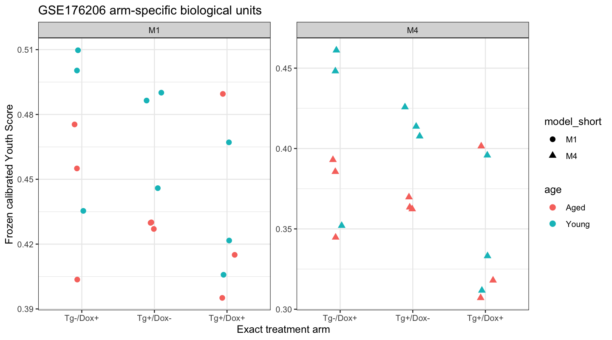
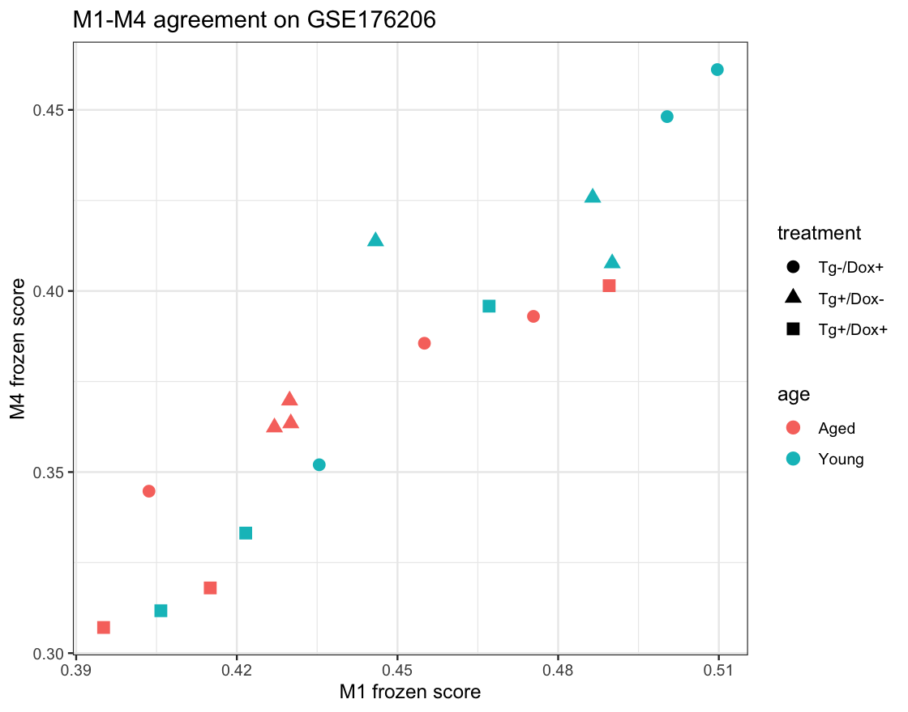

# FACS Youth Score v3.1: GSE176206 External Biological Application

## Frozen scope

M1 and M4 were applied without retraining, recalibration, gene replacement, threshold changes, or score reversal. The authoritative input was `data_geo/processed/GSE176206_msc_sokm.h5ad`, `layers['counts']`.

Numeric animal labels are nested within age and exact treatment arm. No cross-treatment animal pairing was performed. `Tg+/Dox+` was compared separately with `Tg+/Dox-` and `Tg-/Dox+`.

## Coverage

```
                               model     module requested_genes usable_genes
         M1_raw_all_gene_denominator young_high              30           26
         M1_raw_all_gene_denominator   old_high              28           28
 M4_raw_all_gene_denominator_pi_0_90 young_high              16           15
 M4_raw_all_gene_denominator_pi_0_90   old_high              13           13
 gene_coverage weighted_coverage coverage_pass
     0.8666667         0.8702639          TRUE
     1.0000000         1.0000000          TRUE
     0.9375000         0.9224784          TRUE
     1.0000000         1.0000000          TRUE
```

## Baseline control age direction

```
                               model control_arm young_n aged_n young_median
         M1_raw_all_gene_denominator    Tg+/Dox-       3      3    0.4864468
         M1_raw_all_gene_denominator    Tg-/Dox+       3      3    0.5003444
 M4_raw_all_gene_denominator_pi_0_90    Tg+/Dox-       3      3    0.4137237
 M4_raw_all_gene_denominator_pi_0_90    Tg-/Dox+       3      3    0.4481454
 aged_median young_minus_aged_median young_minus_aged_mean auc_young_vs_aged
   0.4298494              0.05659736            0.04516548         1.0000000
   0.4550264              0.04531800            0.03714685         0.7777778
   0.3634690              0.05025464            0.05052512         1.0000000
   0.3855685              0.06257686            0.04600263         0.7777778
```

## Unpaired SOKM-control contrasts

```
                               model   age control_arm n_sokm n_control
         M1_raw_all_gene_denominator Young    Tg+/Dox-      3         3
         M1_raw_all_gene_denominator Young    Tg-/Dox+      3         3
         M1_raw_all_gene_denominator  Aged    Tg+/Dox-      3         3
         M1_raw_all_gene_denominator  Aged    Tg-/Dox+      3         3
 M4_raw_all_gene_denominator_pi_0_90 Young    Tg+/Dox-      3         3
 M4_raw_all_gene_denominator_pi_0_90 Young    Tg-/Dox+      3         3
 M4_raw_all_gene_denominator_pi_0_90  Aged    Tg+/Dox-      3         3
 M4_raw_all_gene_denominator_pi_0_90  Aged    Tg-/Dox+      3         3
 sokm_median control_median median_difference sokm_mean control_mean
   0.4216594      0.4864468       -0.06478739 0.4315249    0.4741473
   0.4216594      0.5003444       -0.07868499 0.4315249    0.4818162
   0.4150354      0.4298494       -0.01481400 0.4332264    0.4289818
   0.4150354      0.4550264       -0.03999097 0.4332264    0.4446694
   0.3331498      0.4137237       -0.08057389 0.3468931    0.4157163
   0.3331498      0.4481454       -0.11499562 0.3468931    0.4204293
   0.3180030      0.3634690       -0.04546602 0.3421861    0.3651911
   0.3180030      0.3855685       -0.06756553 0.3421861    0.3744266
 mean_difference
     -0.04262237
     -0.05029135
      0.00424463
     -0.01144298
     -0.06882322
     -0.07353621
     -0.02300508
     -0.03224057
```

## Direction gates

```
                               model young_higher_in_both_controls
         M1_raw_all_gene_denominator                          TRUE
 M4_raw_all_gene_denominator_pi_0_90                          TRUE
                               model   age sokm_lower_than_both_controls
         M1_raw_all_gene_denominator  Aged                          TRUE
 M4_raw_all_gene_denominator_pi_0_90  Aged                          TRUE
         M1_raw_all_gene_denominator Young                          TRUE
 M4_raw_all_gene_denominator_pi_0_90 Young                          TRUE
```

## M1-M4 agreement

```
                      scope  stratum  n  spearman
                    overall      all 18 0.9298246
                 within_age     Aged  9 0.9666667
                 within_age    Young  9 0.9166667
           within_treatment Tg+/Dox+  6 1.0000000
           within_treatment Tg+/Dox-  6 0.7714286
           within_treatment Tg-/Dox+  6 1.0000000
 age_treatment_residualized      all 18 0.9071207
```

## State interpretation

State-restricted contrasts passing the minimum representation rule: 32. Pure reprogramming states absent from controls are interpreted as composition changes, not within-state effects.

## Identity and Risk boundary

Formal Youth-Identity and Youth-Risk coupling remain not assessable because no standalone frozen Identity or Risk scorer was available before outcome analysis. No proxy was invented.

## Claims boundary

This analysis assesses external directional and perturbation-related biological consistency. It does not validate a continuous aging clock, prove rejuvenation or accelerated aging, or select M4 from effect magnitude alone. Bootstrap intervals are descriptive because each age-treatment arm has three animals.

## Figures




