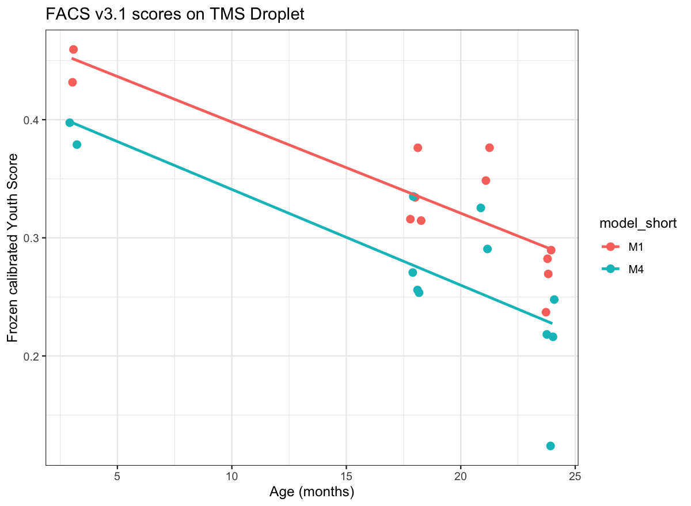
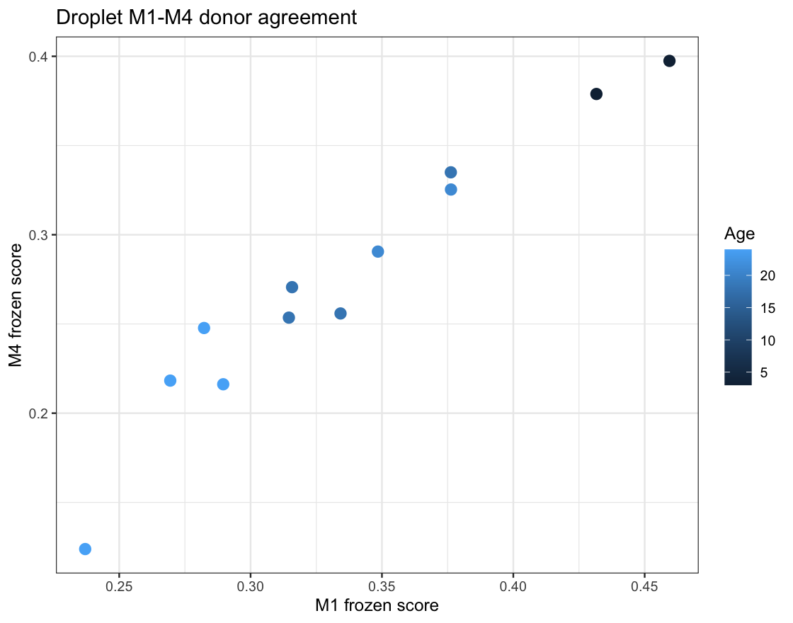

# FACS Youth Score v3.1: TMS Droplet Cross-Assay Transportability

## Frozen scope

M1 and M4 were applied unchanged to the audited processed Droplet mouse pseudobulk. Droplet was not used for training, feature selection, weighting, calibration, threshold selection, or score orientation.

The parser denominator was the 20,138-gene pseudobulk column sum (`total_counts`). The legacy metadata field `raw_library_size` was treated as a filtered-DGE library size and was not supplied to the parser.

## Input audit

```
                               check passed
       counts_dimensions_20138_by_12   TRUE
         counts_metadata_mouse_order   TRUE
                  age_counts_2_4_2_4   TRUE
 all_gene_colsum_equals_total_counts   TRUE
  filtered_DGE_matches_edgeR_libsize   TRUE
       effective_library_matches_TMM   TRUE
    parser_uses_all_gene_denominator   TRUE
                coverage_gate_passed   TRUE
```

## Coverage

```
                               model     module requested_genes usable_genes
         M1_raw_all_gene_denominator young_high              30           30
         M1_raw_all_gene_denominator   old_high              28           28
 M4_raw_all_gene_denominator_pi_0_90 young_high              16           16
 M4_raw_all_gene_denominator_pi_0_90   old_high              13           13
 gene_coverage weighted_coverage coverage_pass
             1                 1          TRUE
             1                 1          TRUE
             1                 1          TRUE
             1                 1          TRUE
```

## Transportability metrics

```
                               model n_mice young_median old_median
         M1_raw_all_gene_denominator     12    0.4455352  0.3151838
 M4_raw_all_gene_denominator_pi_0_90     12    0.3881576  0.2547092
 age_3_median age_18_median age_21_median age_24_median auc all_age_rho
    0.4455352     0.3250120     0.3623739     0.2758630   1  -0.8079193
    0.3881576     0.2632498     0.3079492     0.2172227   1  -0.8297550
 old_only_rho young_minus_old_median all_gene_library_rho
   -0.6617241              0.1303513          -0.02797203
   -0.7006490              0.1334485          -0.03496503
 filtered_DGE_library_rho effective_library_rho cell_count_rho
              -0.02797203           -0.04895105     -0.0979021
              -0.03496503           -0.05594406     -0.1048951
 detected_genes_rho
          0.3356643
          0.3076923
```

## M1-M4 agreement

```
                  scope  n  spearman
                overall 12 0.9650350
             young_only  2        NA
               old_only 10 0.9393939
 age_group_residualized 12 0.9300699
 exact_age_residualized 12 0.8461538
```

## Paired donor bootstrap

```
    contrast                   metric observed_difference bootstrap_q025
 M4_minus_M1                      auc         0.000000000     0.00000000
 M4_minus_M1              all_age_rho        -0.021835657    -0.14198721
 M4_minus_M1             old_only_rho        -0.038924947    -0.23249607
 M4_minus_M1   young_minus_old_median         0.003097124    -0.02014344
 M4_minus_M1     all_gene_library_rho        -0.006993007    -0.25549329
 M4_minus_M1 filtered_DGE_library_rho        -0.006993007    -0.25549329
 M4_minus_M1    effective_library_rho        -0.006993007    -0.25092251
 M4_minus_M1           cell_count_rho        -0.006993007    -0.25549329
 M4_minus_M1       detected_genes_rho        -0.027972028    -0.25806452
 bootstrap_median bootstrap_q975 valid_draws requested_draws
     0.0000000000     0.00000000        4445            5000
     0.0000000000     0.00000000        5000            5000
     0.0000000000     0.00000000        4997            5000
    -0.0009703432     0.02561509        4445            5000
     0.0000000000     0.26415431        5000            5000
     0.0000000000     0.26415431        5000            5000
     0.0000000000     0.26277372        5000            5000
     0.0000000000     0.26415431        5000            5000
     0.0000000000     0.18573093        5000            5000
```

## Claims boundary

This is a within-TMS cross-assay transportability and robustness check, not fully independent external validation and not a winner-selection test. Bootstrap intervals quantify 12-mouse sampling uncertainty; they do not authorize model tuning.

## Figures




