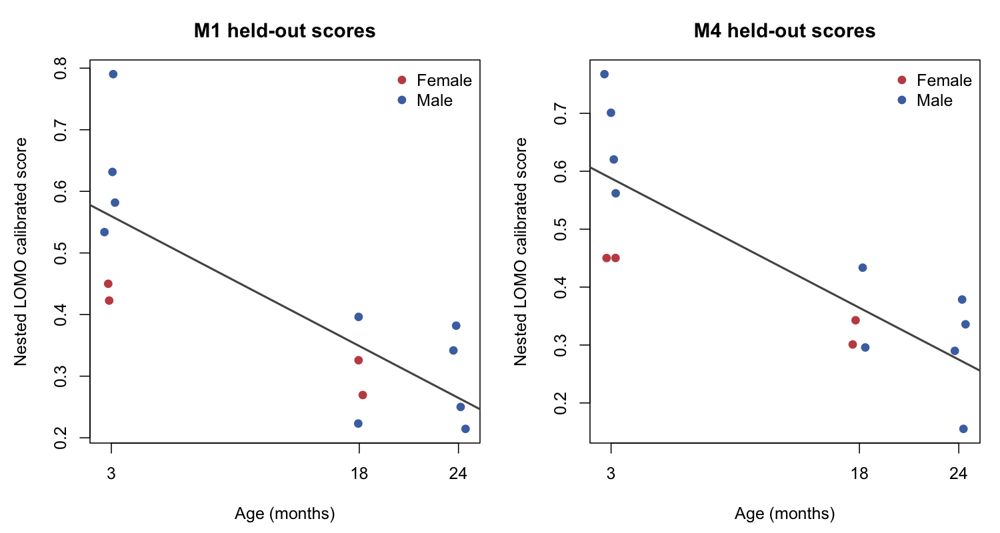
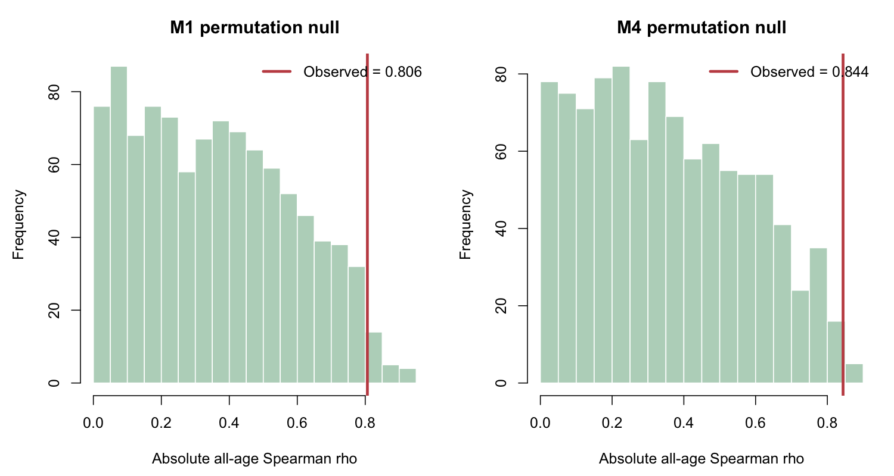
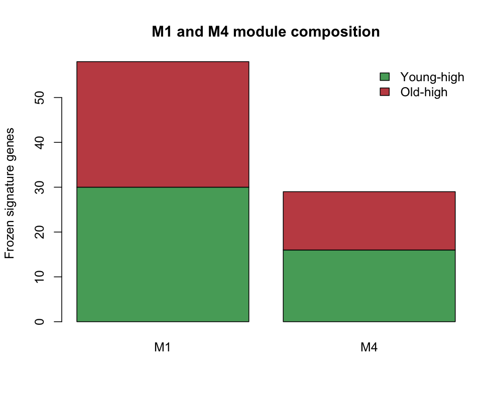

# FACS Limb Muscle MSC Youth Score v3.1: Training Experiment Report

This GitHub report combines the complete controlled M0-M4 training report, full-data M1/M4 freeze report, and formal 999-permutation report. The source sections below are preserved without deleting their methods, results, or limitations.

## Delivered Models

- M1: primary deployable reference, $\pi_g\geq0.75$, 58 genes.
- M4: post-ablation exploratory comparator, $\pi_g\geq0.90$, 29 genes.

## Training Figures







## Part I: Controlled M0-M4 Training and Ablation

# FACS Youth Score v3.1 M0-M4: Algorithm and Training Final Report

## 1. Report Scope

This report documents the controlled M0-M4 Youth Score v3.1 experiment, including the shared training algorithm, the exact change made in each branch, nested leave-one-mouse-out results, technical-association diagnostics, signature stability, provenance controls, and the final scientific interpretation.

The experiment is a controlled model-diagnostic study. M1, M2, and M3 are independent branches from M0. M2 does not inherit the M1 normalization change. M4 was defined only after reviewing M1-M3 and is therefore an explicitly post-ablation exploratory model.

All reported performance metrics use held-out mouse scores from nested leave-one-mouse-out analysis. They are not full-data apparent-fit scores.

## 2. Training Data

The input is the diaphragm-excluded TMS FACS Limb Muscle MSC dataset in `data_facs/raw_data`.

| Item | Value |
|---|---:|
| Genes | 22,966 |
| Cells | 815 |
| Mice | 14 |
| Young cells, 3 months | 264 |
| Old cells, 18 or 24 months | 551 |
| Young mice | 6 |
| Old mice | 8 |
| Diaphragm cells | 0 |
| Standardized forelimb/hindlimb cells | 815 |

Donor composition was:

| Age | Female mice | Male mice | Female cells | Male cells |
|---|---:|---:|---:|---:|
| 3 months | 2 | 4 | 130 | 134 |
| 18 months | 2 | 2 | 158 | 76 |
| 24 months | 0 | 4 | 0 | 317 |

The absence of 24-month female mice means sex and the oldest age level are partially confounded. The factorial model can estimate young-versus-old effects in both sexes, but it cannot independently estimate a female 18-to-24-month trajectory. Four outer folds have at least one factorial cell represented by only one training mouse; these folds were retained and marked as weak-support folds.

Two cells from donor `24_59_M` have metadata `n_counts` values differing from MTX-derived totals by +2 and -5 counts. The MTX is the expression source of truth, and matrix-derived pseudobulk is exactly reproduced, so this discrepancy does not alter model training or scoring. It remains a documented metadata qualification.

## 3. Analysis Unit and Validation

Single-cell raw counts were summed within each mouse:

$$
C_{gm}=\sum_{c\in m}C_{gc},
$$

where $C_{gc}$ is the raw count for gene $g$ in cell $c$, and $C_{gm}$ is the mouse-level pseudobulk count.

Validation used fully nested outer leave-one-mouse-out analysis. For each held-out mouse $m$:

1. remove mouse $m$;
2. filter genes using outer-training mice only;
3. estimate TMM factors and voom weights using outer-training mice only;
4. fit DE models using outer-training mice only;
5. rerun inner leave-one-mouse-out stability selection inside the outer-training set;
6. choose genes, modules, and weights without the held-out mouse;
7. estimate gene means, standard deviations, and calibration centers using outer-training mice only;
8. score the untouched held-out mouse.

Cells were never treated as independent validation observations.

## 4. Shared M0 Algorithm

### 4.1 Gene filtering

Within each training partition, a gene was retained when:

$$
\mathrm{CPM}_{gm}>1
$$

in at least two training mice. Across outer folds, 12,535 to 12,777 genes were retained, with a median of 12,708.

### 4.2 TMM and voom

Training pseudobulk counts were normalized using TMM. Limma-voom was then used to estimate the mean-variance relationship and fit moderated linear models. TMM and voom were used for DE estimation; they were not learned from the held-out donor.

### 4.3 Age-only and factorial DE

The age-only consistency model was:

$$
E_g \sim \mathrm{AgeGroup}.
$$

The factorial cell-means model was:

$$
E_g \sim 0+\mathrm{Sex}:\mathrm{AgeGroup}.
$$

The four estimated cell means were female-young, male-young, female-old, and male-old. The following contrasts were calculated:

$$
\beta_{g,F}=\mu_{g,F,O}-\mu_{g,F,Y},
$$

$$
\beta_{g,M}=\mu_{g,M,O}-\mu_{g,M,Y},
$$

$$
\beta_{g,C}=\frac{\beta_{g,F}+\beta_{g,M}}{2},
$$

$$
\beta_{g,I}=\beta_{g,M}-\beta_{g,F}.
$$

Here $F$, $M$, $Y$, $O$, $C$, and $I$ denote female, male, young, old, common, and age-by-sex interaction effects.

### 4.4 Reliability rules and ranking

A gene passed the outer reliability screen when:

- female and male age effects had the same nonzero direction;
- the age-only and common factorial effects had the same nonzero direction;
- the gene was not in the frozen sex-linked exclusion list;
- the common effect and moderated $t$ statistic were finite.

The interaction ratio and penalty were:

$$
R_g=\frac{|\beta_{g,I}|}{|\beta_{g,F}|+|\beta_{g,M}|+\epsilon},
$$

$$
P_g=\frac{1}{1+R_g}.
$$

The ranking weight was:

$$
w_g=|\beta_{g,C}|\,|t_{g,C}|\,P_g.
$$

Genes with $\beta_{g,C}<0$ were assigned to the young-high module; genes with $\beta_{g,C}>0$ were assigned to the old-high module.

### 4.5 Nested stability selection

Inside each outer-training set, provisional signatures were reconstructed in inner leave-one-mouse-out folds. Each provisional signature contained at most 50 young-high and 50 old-high genes.

For gene $g$, inner selection frequency was:

$$
\pi_g=\frac{\text{eligible inner folds selecting }g}
{\text{number of eligible inner folds}}.
$$

M0 retained genes with:

$$
\pi_g\geq0.75.
$$

The stable pool was reranked using the complete outer-training partition, with a cap of 100 genes per module and no backfill. Four weak-support outer folds each contained one rank-deficient inner split. Those inner splits were skipped and counted; the design was not silently simplified.

### 4.6 Historical scoring transform

M0 used the historical filtered-library denominator:

$$
X_{gm}^{(F)}=
\log_2\left(
10^6\frac{C_{gm}}{\sum_{h\in G_{fold}}C_{hm}}+1
\right),
$$

where $G_{fold}$ is the outer-fold retained-gene set.

Training-only gene means and standard deviations were used:

$$
Z_{gm}=\frac{X_{gm}-\mu_g^{train}}{s_g^{train}}.
$$

For module $A$, the weighted module score was:

$$
S_A(m)=\frac{\sum_{g\in A}w_g Z_{gm}}
{\sum_{g\in A}w_g}.
$$

The raw Youth Score was:

$$
Y_m^{raw}=S_{young}(m)-S_{old}(m).
$$

Let $M_Y$ and $M_O$ be the median raw scores among young and old outer-training mice. The calibrated held-out score was:

$$
Y_m=\frac{Y_m^{raw}-M_O}{M_Y-M_O}.
$$

Training medians are therefore anchored to 1 for young and 0 for old by construction. This calibration separation is not validation evidence; only held-out scores are used for the metrics below.

## 5. Controlled Branches

## 5.1 M0: Exact v2.1 Stability-Selected Reference

Branch name: `M0_factorial_stability_selected_v2_1_exact`.

M0 preserves the historical v2.1 factorial stability-selected implementation exactly, including the unadjusted DE models, $\pi_g\geq0.75$, and filtered-library scoring denominator. The reproduced pseudobulk, metadata, nested score table, signature table, diagnostics, and summary are exactly identical to the historical v2.1 outputs.

M0 is a provenance reference, not a newly optimized v3.1 model.

## 5.2 M1: Raw All-Gene Scoring Denominator

Branch name: `M1_raw_all_gene_denominator`.

M1 changes only the scoring denominator:

$$
X_{gm}^{(R)}=
\log_2\left(
10^6\frac{C_{gm}}{\sum_{h\in G_{all}}C_{hm}}+1
\right).
$$

Every M1 fold reuses the exact M0 genes, module assignments, weights, gene filters, DE results, and stability decisions. Training means, standard deviations, calibration centers, and held-out scores are recomputed because they depend on the expression transform.

M1 tests whether the historical old-donor ordering was caused by the filtered-library scoring implementation.

## 5.3 M2: Technical Covariates in DE Only

Branch name: `M2_adjusted_de_historical_scoring`.

M2 starts directly from M0 and does not inherit M1. Within each training partition, it calculates:

$$
z_L=z\{\log(1+L_m^{raw})\},
$$

$$
z_C=z\{\log(1+N_m^{cells})\}.
$$

The adjusted models are:

$$
E_g\sim \mathrm{AgeGroup}+z_L+z_C,
$$

$$
E_g\sim0+\mathrm{Sex}:\mathrm{AgeGroup}+z_L+z_C.
$$

M2 retains the M0 filter, TMM/voom procedure, contrasts, reliability rules, interaction penalty, ranking formula, $\pi_g\geq0.75$, signature cap, weights, historical filtered-library scorer, and calibration.

All 14 adjusted outer designs were full rank with positive residual degrees of freedom. Rank-deficient inner splits were recorded and skipped rather than changing the model.

## 5.4 M3: Stability-Threshold Ablation

M3 starts directly from M0 and changes only the inner stability threshold:

- `M3_pi_0_50`: $\pi_g\geq0.50$;
- `M3_pi_0_75`: $\pi_g\geq0.75$;
- `M3_pi_0_90`: $\pi_g\geq0.90$.

All three M3 branches retain unadjusted M0 DE and the historical filtered-library scorer. `M3_pi_0_75` is an implementation control and exactly reproduces M0 scores and signatures.

## 5.5 M4: Exploratory Raw-Denominator, High-Stability Combination

Branch name: `M4_raw_all_gene_denominator_pi_0_90`.

M4 combines:

1. the M1 raw all-gene denominator;
2. the exact M3 $\pi_g\geq0.90$ fold signatures, modules, and weights.

M4 retains the unadjusted M0 DE design and does not include M2 technical covariates or a gene-level technical penalty.

M4 was frozen after observing M1-M3 results. It is a post-ablation exploratory sensitivity model and cannot be treated as a prespecified primary model.

## 6. Training and Nested LOMO Results

### 6.1 Age-related performance

| Branch | Valid folds | AUC | All-age $\rho$ | Old-only $\rho$ | Young-old median difference |
|---|---:|---:|---:|---:|---:|
| M0 exact reference | 14 | 1.000 | -0.806 | -0.109 | 0.2602 |
| M1 raw denominator | 14 | 1.000 | -0.806 | -0.109 | 0.2601 |
| M2 adjusted DE | 14 | 1.000 | -0.713 | +0.436 | 0.2677 |
| M3 $\pi=0.50$ | 14 | 0.979 | -0.670 | +0.436 | 0.3029 |
| M3 $\pi=0.75$ | 14 | 1.000 | -0.806 | -0.109 | 0.2602 |
| M3 $\pi=0.90$ | 14 | 1.000 | -0.844 | -0.327 | 0.2729 |
| M4 raw denominator, $\pi=0.90$ | 14 | 1.000 | -0.844 | -0.327 | 0.2728 |

Higher scores denote the young-like direction. Therefore negative age correlations are directionally compatible with a Youth Score.

### 6.2 Technical-variable associations

| Branch | Raw library $\rho$ | Effective library $\rho$ | Cell count $\rho$ | Detected genes $\rho$ |
|---|---:|---:|---:|---:|
| M0 exact reference | -0.692 | -0.473 | -0.557 | +0.042 |
| M1 raw denominator | -0.692 | -0.473 | -0.557 | +0.042 |
| M2 adjusted DE | -0.653 | -0.508 | -0.590 | +0.037 |
| M3 $\pi=0.50$ | -0.552 | -0.459 | -0.506 | -0.095 |
| M3 $\pi=0.75$ | -0.692 | -0.473 | -0.557 | +0.042 |
| M3 $\pi=0.90$ | -0.727 | -0.468 | -0.559 | +0.099 |
| M4 raw denominator, $\pi=0.90$ | -0.727 | -0.468 | -0.559 | +0.099 |

None of the branches demonstrates technical independence. In particular, the stronger negative age ordering in M3 $\pi=0.90$ and M4 is accompanied by stronger association with raw library size.

### 6.3 Signature size and stability

| Branch | Median genes | Young-high | Old-high | Module imbalance | Fold Jaccard | Fold Jaccard vs M0 | Pooled Jaccard vs M0 |
|---|---:|---:|---:|---:|---:|---:|---:|
| M0 exact reference | 54.5 | 29.5 | 26.0 | 2.5 | 0.407 | 1.000 | 1.000 |
| M1 raw denominator | 54.5 | 29.5 | 26.0 | 2.5 | 0.407 | 1.000 | 1.000 |
| M2 adjusted DE | 52.0 | 26.5 | 26.0 | 1.5 | 0.422 | 0.213 | 0.239 |
| M3 $\pi=0.50$ | 77.0 | 39.5 | 37.5 | 3.0 | 0.417 | 0.737 | 0.755 |
| M3 $\pi=0.75$ | 54.5 | 29.5 | 26.0 | 2.5 | 0.407 | 1.000 | 1.000 |
| M3 $\pi=0.90$ | 31.0 | 17.0 | 14.0 | 2.5 | 0.352 | 0.570 | 0.689 |
| M4 raw denominator, $\pi=0.90$ | 31.0 | 17.0 | 14.0 | 2.5 | 0.352 | 0.570 | 0.689 |

All branches had zero empty or invalid outer signatures and four weak-support folds.

### 6.4 Donor-score changes relative to M0

| Branch | Spearman vs M0 | Median absolute score change | Maximum absolute score change |
|---|---:|---:|---:|
| M0 exact reference | 1.000 | 0 | 0 |
| M1 raw denominator | 1.000 | 0.000041 | 0.000158 |
| M2 adjusted DE | 0.736 | 0.1281 | 0.3672 |
| M3 $\pi=0.50$ | 0.925 | 0.0326 | 0.0796 |
| M3 $\pi=0.75$ | 1.000 | 0 | 0 |
| M3 $\pi=0.90$ | 0.991 | 0.0299 | 0.0727 |
| M4 raw denominator, $\pi=0.90$ | 0.991 | 0.0299 | 0.0727 |

M4 and M3 $\pi=0.90$ have score Spearman correlation 1.000. Their median absolute calibrated difference is $4.36\times10^{-5}$, and the maximum difference is $1.74\times10^{-4}$.

## 7. Branch-Level Conclusions

### M0

M0 exactly restores the historical negative old-only direction, but its magnitude is weak:

$$
\rho_{old}=-0.109.
$$

It also remains strongly associated with raw library size and cell count. M0 is useful as the exact historical reference, not as evidence of a validated continuous aging clock.

### M1

Changing the scoring denominator produces negligible numerical changes and preserves every donor rank. Therefore the historical negative old-only direction does not depend on the filtered-library denominator. The raw all-gene denominator is the scientifically preferable deployable transform and M1 is the corrected-denominator reference.

### M2

Adding raw-library and cell-count covariates to DE changes the selected genes substantially. Median foldwise overlap with M0 falls to 0.213, and old-only ordering reverses from -0.109 to +0.436. Raw-library correlation improves only modestly, while effective-library and cell-count correlations worsen. M2 does not provide coherent technical-robustness improvement and is not recommended.

### M3 $\pi=0.50$

Relaxing stability selection increases the median signature to 77 genes and reduces several technical correlations in magnitude, but AUC falls and old-only ordering reverses to +0.436. This branch is not recommended.

### M3 $\pi=0.75$

This branch exactly reproduces M0 and validates the parameterized stability runner.

### M3 $\pi=0.90$

Stricter stability selection produces more negative all-age and old-only correlations and a smaller 31-gene median signature. However, raw-library association becomes stronger and cross-fold signature Jaccard declines. It demonstrates a trade-off between descriptive age ordering, technical coupling, and fold stability rather than an unqualified improvement.

### M4

M4 preserves the M3 $\pi=0.90$ ranking almost exactly after adopting the raw all-gene denominator. This shows that the stricter stability threshold, rather than the scoring denominator, is responsible for the more negative old-only ordering.

Because M4 was constructed after reviewing the single-factor ablations, it remains an exploratory comparator and cannot be promoted to a confirmatory primary model using these donors.

## 8. Final Scientific Judgment

No tested branch simultaneously improves:

1. young-old separation and age ordering;
2. technical-variable independence;
3. cross-fold signature stability.

The final roles are therefore:

| Model | Final role |
|---|---|
| M0 | Exact historical v2.1 reference |
| M1 | Corrected-denominator reference for deployable scoring |
| M2 | Rejected technical-adjustment sensitivity |
| M3 $\pi=0.50$ | Rejected low-stringency sensitivity |
| M3 $\pi=0.75$ | M0 implementation control |
| M3 $\pi=0.90$ | Exploratory high-stringency comparator |
| M4 | Exploratory raw-denominator high-stringency comparator |

The experiment supports a reproducible young-old state separation and diagnoses how normalization, DE adjustment, and stability threshold alter donor ordering. It does not establish technical independence, an externally validated continuous aging trajectory, or a universal aging clock.

Further tuning on the same 14 donors is not recommended. The next informative analysis is a prespecified external or cross-assay comparison of frozen M1 and M4, with no threshold, signature, weighting, or calibration changes.

## 9. Reproducibility and Audit Status

The code-content audit found no critical scientific-logic error, erroneous branch inheritance, duplicate key, missing held-out score, empty signature, or invalid calibration denominator.

Verified controls include:

- historical v2.1 input and output exact matching;
- M1 signatures exactly equal to M0;
- M3 $\pi=0.75$ scores and signatures exactly equal to M0;
- M4 signatures and weights exactly equal to M3 $\pi=0.90$;
- 98 of 98 held-out scores finite;
- gene coverage equal to 1.0 in every fold;
- all 17 locked metrics present for every branch.

One implementation limitation is retained in the audit record: M4 currently stores `weak_support_folds = 4L` as a literal value. The value is correct for this frozen cohort but should be derived from diagnostics if the code is generalized to another cohort.

## 10. Key Files

Frozen protocol:

- `Youth_score_v3_1_controlled_ablation_frozen_pipeline.md`

Scripts:

- `scripts/facs_v3_1_step01_03_reproduce_v2_1_inputs.R`
- `scripts/facs_v3_1_step04_reproduce_v2_1_stability_selected.R`
- `scripts/facs_v3_1_step05_verify_v2_1_stability_reproduction.R`
- `scripts/facs_v3_1_step06_run_controlled_ablations_m1_m3.R`
- `scripts/facs_v3_1_step07_run_exploratory_m4.R`
- `scripts/facs_v3_1_step08_finalize_ablation_comparison.R`

Core results:

- `outputs/facs_v3_1/controlled_ablation/m0_m4_complete_branch_summary.csv`
- `outputs/facs_v3_1/controlled_ablation/m0_m3_branch_nested_scores.csv`
- `outputs/facs_v3_1/controlled_ablation/m0_m3_branch_fold_signatures.csv`
- `outputs/facs_v3_1/controlled_ablation/m0_m3_branch_fold_diagnostics.csv`
- `outputs/facs_v3_1/controlled_ablation/m0_m3_paired_donor_score_changes.csv`
- `outputs/facs_v3_1/controlled_ablation/m4_nested_scores.csv`
- `outputs/facs_v3_1/controlled_ablation/m4_fold_signatures.csv`
- `outputs/facs_v3_1/controlled_ablation/m4_paired_donor_changes.csv`

Audit and provenance:

- `outputs/facs_v3_1/controlled_ablation/v3_1_code_content_audit_report.md`
- `outputs/facs_v3_1/controlled_ablation/v3_1_code_content_audit_checks.csv`
- `outputs/facs_v3_1/controlled_ablation/v3_1_controlled_ablation_artifact_manifest.csv`

## Part II: Full-Data Candidate Freeze

# FACS Youth Score v3.1 M1/M4 Candidate Freeze Report

Status: frozen for permutation and external validation

## Models

M1 is the primary deployable reference at inner stability threshold 0.75. M4 is the post-ablation exploratory secondary candidate at threshold 0.90. Both use the raw all-gene library denominator and the exact unadjusted factorial reliability pipeline.

## Full-Data Training

- Input: 22966 genes x 14 mice
- Retained genes: 12824
- Eligible inner LOMO folds: 14
- Provisional inner signatures: at most 50 genes per module
- Full-data final cap: at most 100 genes per module, no backfill
- Scoring: frozen raw all-gene log2(CPM+1), training mean/SD, and training young/old median calibration

```
                               model                                role
         M1_raw_all_gene_denominator        primary_deployable_reference
 M4_raw_all_gene_denominator_pi_0_90 post_ablation_exploratory_secondary
 stability_threshold stable_pool_size signature_size young_high_n old_high_n
                0.75               58             58           30         28
                0.90               29             29           16         13
 calibration_denominator
                 2.65029
                 2.70224
```

The stability frequencies were recomputed by explicit inner LOMO over all 14 mice. They were not copied from an external dataset or from a full-data apparent fit.

## Parser Validation

```
                               model max_abs_raw_difference
         M1_raw_all_gene_denominator           1.110223e-15
 M4_raw_all_gene_denominator_pi_0_90           2.442491e-15
 max_abs_calibrated_difference
                  1.998401e-15
                  1.179612e-15
 max_abs_existing_score_change_after_sample_addition full_gene_coverage
                                                   0                  1
                                                   0                  1
 full_weighted_coverage full_coverage_pass low_coverage_error_triggered
                      1               TRUE                         TRUE
                      1               TRUE                         TRUE
```

The parser reproduces the independent training implementation within 1e-12, preserves existing sample scores when an extra sample is added, reports complete training coverage, and rejects a deliberately feature-limited input.

## Interpretation Boundary

The exported full-data scores are apparent training scores used only for calibration and parser verification. They are not internal validation evidence. Nested LOMO and the planned label permutation remain the internal inferential analyses.

## Part III: Formal 999-Permutation Validation

# FACS Youth Score v3.1 M1/M4 Permutation: formal_999_m1_m4

Status: formal frozen-pipeline permutation analysis

- Requested null assignments: 999
- Attempted null assignments: 999
- Valid M1 null results: 999
- Valid M4 null results: 999
- Failed assignments: 0
- Parallel workers: 6

## Frozen Method

Complete 3m/18m/24m labels were reassigned within sex strata. Every assignment reran outer LOMO, training-only filtering, TMM, voom, age-only and factorial DE, inner LOMO stability, outer ranking, weights, raw-library scoring, training standardization, calibration, and held-out scoring.

M1 and M4 share each assignment and the DE/inner-LOMO computations that are mathematically identical before thresholding. The 0.75 and 0.90 stable pools, outer signatures, and held-out scores are reconstructed separately within every fold. No real-label signature is reused.

## Provenance Controls

```
                                     check passed
 observed_scores_match_controlled_ablation   TRUE
        all_requested_permutations_present   TRUE
    all_permutations_valid_for_both_models   TRUE
                    all_assignments_unique   TRUE
   all_assignments_preserve_sex_age_counts   TRUE
         all_runs_have_14_scores_per_model   TRUE
                   no_zero_signature_folds   TRUE
             no_rank_deficient_outer_folds   TRUE
          observed_four_weak_support_folds   TRUE
              shared_assignments_for_m1_m4   TRUE
```

## Formal Null Summary

```
                               model                 metric
         M1_raw_all_gene_denominator        abs_all_age_rho
         M1_raw_all_gene_denominator auc_distance_from_half
         M1_raw_all_gene_denominator young_minus_old_median
 M4_raw_all_gene_denominator_pi_0_90        abs_all_age_rho
 M4_raw_all_gene_denominator_pi_0_90 auc_distance_from_half
 M4_raw_all_gene_denominator_pi_0_90 young_minus_old_median
                 role  observed   null_mean   null_sd null_median    null_q025
              primary 0.8063484  0.35846625 0.2293743  0.34691735  0.009376145
           supporting 0.5000000  0.21828078 0.1383676  0.20833333  0.020833333
 recorded_not_primary 0.2601431 -0.07667322 0.1293901 -0.07781804 -0.336155530
              primary 0.8438530  0.35474958 0.2247073  0.33285313  0.018752289
           supporting 0.5000000  0.21486069 0.1393194  0.20833333  0.000000000
 recorded_not_primary 0.2727933 -0.08675858 0.1620628 -0.08128812 -0.400432593
 null_q975   z_null empirical_p valid_null_n
 0.7880650 1.952626       0.023          999
 0.5000000 2.036020       0.039          999
 0.1723833 2.603107       0.002          999
 0.7922842 2.176625       0.010          999
 0.5000000 2.046660       0.036          999
 0.1927153 2.218596       0.007          999
```

Empirical p-values use (1 + exceedances) / (1 + valid null runs). Failed assignments, if any, are retained and are not replaced.

## Interpretation Boundary

This test asks whether each predefined nested pipeline has stronger age-label association than its sex-stratified randomized-label null. It does not prove technical independence, external validity, a continuous aging clock, or M4 superiority. M4 remains post-ablation exploratory even if its formal empirical p-value is small.

## Packaging Boundary

The model directories contain only deployment artifacts and synthetic parser fixtures. Raw training data, permutation checkpoints, and intermediate expression matrices are intentionally excluded. External GSE176206 and Droplet evidence is documented separately under `../cross_assay_comparison/`.
